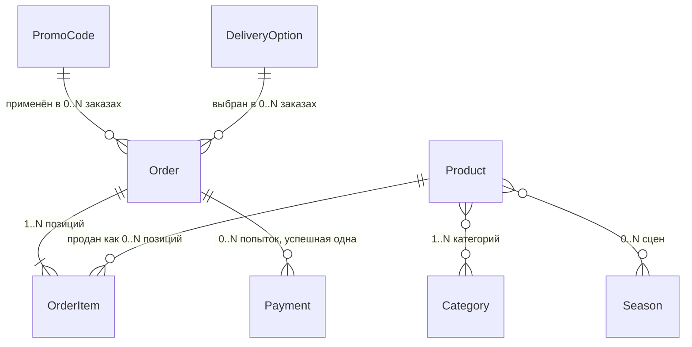

# Сущности

Шаг 2 чертежа: общий словарь главных вещей продукта. Источники: `idea/` целиком (`pitch.md`, `mvp.md`, `proof-of-value.md`, `principles.md`, `vision.md`, `risks.md`, `superidea.md`), `architecture/01-что-строим.md`, `00-правила-проекта.md`, решения владельца из `README.md`, факты о доставке и ценах из `.business/products/pricing.md`. Сверка со сделанным: прототип `prototypes/2026-09-09-katalog/js/data.js` и макет `mockups/v1-scenariy-1/index.html`.

Файла `idea/08-brief.md` в проекте нет, вместо него прочитана вся папка `idea/`.

Это словарь, а не схема базы. Тут - что за вещь, что про неё запоминаем, какие у неё состояния и с чем она связана. Типы полей, индексы, ограничения и миграции - шаг 3 (`03-база-данных.md`).

Всё, чего нет в источниках, помечено ⚠️ и не считается фактом.

**Решение владельца 12.09.2026:** один ролик - один промокод, связь «один к одному». Поэтому отдельной сущности «Кампания» в первой версии нет: поля ролика лежат в Промокоде. Разбор - в 3.4 и 5.1.

## 1. Единые названия

Одно имя на всю работу: в разговоре, в документах, в коде, в базе. Синонимы из макета и прототипа сведены к одному столбцу.

| Имя в разговоре | Имя в коде | Что это | Где живёт |
|---|---|---|---|
| Товар | `Product` | одна из 19 позиций каталога | база |
| Категория | `Category` | линейка: лицо, волосы, тело, масло, наборы | база (справочник) |
| Сезон | `Season` | сцена-тур одного времени года, пока только осень | конфиг |
| Промокод | `PromoCode` | код ролика или канала: источник, выгода, лимит, срок | база |
| Заказ | `Order` | оформленная покупка с источником и статусом | база |
| Позиция заказа | `OrderItem` | одна строка в заказе: товар, цена, количество | база |
| Вариант доставки | `DeliveryOption` | один из семи тарифов корзины | база (справочник) |
| Платёж | `Payment` | попытка оплаты и уведомление от CloudPayments | база |

Восемь сущностей. Слова, которые в макете и прототипе звучали по-разному, а значат одно:

| Встречалось | Единое имя |
|---|---|
| «канал», «ролик», «кампания», «источник трафика» | поля внутри **Промокода** (площадка, ролик, дата, метка) и снимок источника в **Заказе** |
| «линейка», «cats», «фильтр каталога» | **Категория** |
| «город», поле `city` в форме макета | **Адрес доставки** (одна строка с индексом, как в корзине ozonbox.ru) |
| «набор», «сет», «бокс» | это обычный **Товар**, а не отдельная вещь (см. раздел 4) |
| «оплата прошла», «транзакция», «вебхук» | **Платёж** |

## 2. Карта связей

Те же связи словами и числами:

| Связь | Сколько с одной стороны | Сколько с другой | Может ли не быть | Почему так |
|---|---|---|---|---|
| Ролик → Промокод | у ролика ровно 1 код | код принадлежит ровно одному ролику | нет | решение владельца от 12.09.2026; поэтому это не связь двух записей, а одна запись Промокода |
| Промокод → Заказ | один код применяется в 0..N заказах | у заказа 0..1 код | заказ без кода - норма | код многоразовый, с лимитом (решение 1А от 11.09); неверный код покупку не блокирует (решение 3А) |
| Заказ → Позиция заказа | 1..N позиций | позиция принадлежит одному заказу | заказа без позиций не бывает | пустой заказ нельзя оплатить |
| Товар → Позиция заказа | товар продан в 0..N позициях | позиция ссылается ровно на один товар | товар может не продаться ни разу | обычная продажа |
| Товар ↔ Категория | у товара 1..N категорий | в категории 1..N товаров | товара без категории нет | в прототипе у каждого товара 1-2 категории («Стоп акне» - лицо + наборы) |
| Товар ↔ Сезон | товар в 0..N сцен | в сцене 1..N товаров | товар может не попасть ни в одну сцену | в осенней сцене сейчас 4 товара из 19 |
| Вариант доставки → Заказ | тариф выбран в 0..N заказах | у заказа ровно 1 тариф | нет, доставка обязательна | самовывоза в корзине нет (`pricing.md`) |
| Заказ → Платёж | у заказа 0..N платежей | платёж принадлежит одному заказу | у неоплаченного заказа платежей нет | банк может отклонить, покупатель пробует ещё раз; успешный платёж у заказа максимум один |

**Источник у заказа связью не является.** Ссылка на промокод есть не всегда (заказ могли оформить без кода), а источник обязан быть всегда. Поэтому площадка и метки хранятся в самом Заказе снимком, а ссылка на код - дополнением к нему, а не вместо него.

## 3. Сущности по одной

### 3.1 Товар

**Что это.** Позиция каталога: средство или готовый набор, который покупают. Их 19, и в первой версии список не растёт.

| Что храним | Зачем именно это |
|---|---|
| короткое имя для адреса (`stop-akne`) | адрес карточки; позже под него лягут 301-редиректы (`01-что-строим.md`, п. 9) |
| название | «Бокс „Стоп акне“» |
| цена в копейках | правило 5: суммы - целые копейки |
| артикул | есть в прототипе, называется в переписке с покупателем |
| короткая строка «для чего» | «От акне, постакне, дерматита и купероза» |
| состав (список строк) | «Крем ОЗОДЕРМИК 3% - 80 мл», «Озонированное масло ОТРИ 25 мл» |
| выгоды (список строк) | три строки на карточке, проходят проверку на медицинские обещания |
| фото | одно основное, уже ужато, лежит в прототипе |
| бейдж: хит / бестселлер / нет | сегодня это украшение карточки, а не категория |
| опубликован: да / нет | удаление только мягкое (правило «Запрещено») |

**Чего не храним и почему:**

- **старой зачёркнутой цены.** Решение от 12.09: постоянную «скидку» 7-46% в новый сайт не переносим, это риск по закону о рекламе (`pricing.md`, `principles.md`, правило 6). В прототипе поле `old` есть, оно там и остаётся;
- **остатка на складе.** ⚠️ В первой версии нет админки, менять остаток некому, а требования «не продавать то, чего нет» в `01-что-строим.md` нет. Правило 2 говорит, где хранить остатки, а не то, что они обязаны быть. Нужно решение владельца до шага 3;
- **ссылки на старую карточку Tilda.** В прототипе поле `url` есть, но новый сайт строит адрес сам.

**Состояния:** опубликован ↔ скрыт. Меняются правкой в базе, оба редактора делают это не одновременно (`01-что-строим.md`, п. 8).

**Пример.** «Набор „Супер трио“», 289 300 копеек (2 893 ₽), категории «лицо» и «наборы», бейдж «бестселлер», в осенней сцене - да.

### 3.2 Категория

**Что это.** Линейка каталога: лицо, волосы, тело, масло, наборы. Пять значений, ими же работает фильтр витрины.

Храним: короткое имя (`face`), подпись («Лицо»), порядок в фильтре.

**Состояний нет.** Категорию не включают и не выключают: она либо есть в справочнике, либо её нет.

**Почему справочник, а не поле-перечисление в товаре:** товар состоит в нескольких категориях сразу («Стоп акне» - и лицо, и набор), а подписи и порядок хотим менять без выката кода (правило 2).

**Важно не смешать:** «Хиты» в прототипе стоят в одном списке с «Лицо» и «Волосы», но это не линейка, а фильтр по бейджу товара. Бейдж живёт полем в товаре, категория - справочником. Одинаковое поведение на экране не делает их одной вещью.

### 3.3 Сезон

**Что это.** Сцена-тур одного времени года: тексты, подборка товаров, медиа. В первой версии сезон один - осень.

| Что храним | Пример |
|---|---|
| код сезона | `autumn` |
| подписи сцены (заголовок, шаги, подписи к товарам) | «Осенью обостряются высыпания» |
| подборка товаров с порядком | «Супер трио», «Стоп акне», «Очищение», «Озодермик 3%» |
| медиа: видео сцены, постер, CSS-фон заглушки | заглушка - штатный режим, а не временный (`principles.md`, правило 7) |

**Состояния:** сезон либо текущий, либо нет. Текущий - ровно один, это одна настройка.

**Почему конфиг, а не таблица.** Сезон меняется четыре раза в год, вместе с ним приезжают видеофайлы, то есть выкат всё равно нужен. Конфиг лежит в git, виден в ревью и откатывается одной командой. Таблица понадобится вместе с админкой, когда сезон начнёт править человек без разработчика - тогда это перенос данных, а не переделка модели. Правило 2 разрешает оба места: «в базе или конфиге».

### 3.4 Промокод

**Что это.** Код из ролика или директа. Он же - запись об источнике: у ролика ровно один код, у кода ровно один ролик (решение владельца от 12.09.2026). Ради этой сущности проект и затевался: «каждая продажа знает свой источник» (`vision.md`, ядро).

| Что храним | Пример | Зачем |
|---|---|---|
| сам код, уникальный | `OSEN-R1` | его вводят в корзине |
| площадка (перечисление) | `instagram`, `telegram`, `vk`, `ozon`, `wb`, `yandex`, `site`, `unknown` | группировка для отчёта по каналам (сцена 2) |
| название ролика или повода для человека | Reels «Осенняя кожа» от 12.09 | это читает Рафаэль в Telegram |
| дата выхода | 12.09.2026 | отличать ролики одной площадки |
| метка `utm_content` в ссылке | `reels-1209` | запасной способ узнать источник, если код не ввели |
| выгода в процентах от текущей цены | 10 | решение от 12.09.2026 |
| лимит использований | 200 | решение 1А от 11.09 |
| сколько раз использован | 27 | из него считается «лимит исчерпан» |
| действует до | 31.10.2026 | решение 1А от 11.09 |
| выключен вручную: да / нет | нет | закрыть код, не удаляя историю |

**Почему поля ролика лежат здесь, а не в отдельной «Кампании».** При связи «один к одному» отдельная таблица всегда содержала бы ровно одну строку-пару к каждому коду: она добавила бы связь и ни одного нового факта. Развилка целиком - в 5.1.

**Состояния.** Три из четырёх вычисляются, а не хранятся отдельным полем: иначе поле разойдётся с датой и счётчиком.

| Состояние | Как получается | Что видит покупатель |
|---|---|---|
| действует | срок не вышел, лимит не исчерпан, не выключен | выгода 10% и канал заказа |
| срок вышел | сегодня позже даты «действует до» | «Срок действия кода закончился. Можно оформить заказ без выгоды» |
| лимит исчерпан | использован = лимит | «Код этого ролика уже использован нужное число раз» |
| выключен | поднят флаг руками | та же причина, что «код не найден» |

**Не состояния кода, а исходы проверки:** «такого кода нет» и «нет связи с сервером». Кода при этом не существует или он нам неизвестен, поэтому состоянием это быть не может. Во всех четырёх случаях покупка не блокируется (решение 3А от 11.09).

**Что следует из «один к одному».** Когда лимит ролика исчерпан, ходов два: поднять лимит того же кода или закрыть ролик. Выпустить второй код того же ролика (`OSEN-R1-2`) модель тоже позволит, но это будет вторая запись, и в отчёте ролик встанет двумя строками - их придётся складывать глазами. Если это начнёт мешать, из Промокода выделяется Кампания: одна миграция, заказы при этом не трогаем, потому что источник у заказа хранится снимком. Открытый вопрос «что выдавать при исчерпании лимита» в `README.md` этим решением сужен, но не снят.

**Выгода в процентах, а не в рублях** - потому что промокодов на сайте сегодня нет вовсе и сравнивать не с чем; проценты считаются от текущей цены (`pricing.md`).

**Модель «код с лимитом и сроком» покрывает и будущие одноразовые коды:** лимит 1 - частный случай, менять устройство не придётся (`01-что-строим.md`, п. 9).

### 3.5 Заказ

**Что это.** Оформленная покупка. Главная запись проекта: в ней сходятся деньги, персональные данные и источник.

| Группа | Что храним | Почему именно так |
|---|---|---|
| Кто | номер заказа для человека (№1042) | его называют в Telegram и в переписке, он отличается от внутреннего идентификатора |
| Кто | имя, телефон, email | контакты для отгрузки и чека, лежат только в базе в РФ |
| Куда | адрес одной строкой с индексом | ровно так работает корзина ozonbox.ru сегодня |
| Куда | выбранный вариант доставки + снимок его названия и цены | тариф потом поменяется, а заказ должен остаться правдой |
| Деньги | сумма товаров, выгода, доставка, итого - в копейках | правило 5 |
| Откуда | ссылка на промокод + снимок самого кода строкой | код могут выключить или удалить, заказ обязан помнить, с чем он оплачен |
| Откуда | площадка, `utm_source`, `utm_content`, название ролика снимком | «источник хранится разборным, а не одной склеенной строкой» (`01-что-строим.md`, п. 9) |
| Откуда | признак «источник неизвестен» | заказ без источника создать нельзя: пишем `unknown` и помечаем как проблему (правило «Всегда» 1) |
| Юридика | время согласия на оферту, время согласия на обработку данных, согласие на рассылку да/нет, версия документов | раздельные согласия - условие первого рубля (`principles.md`, правило 5) |
| Оплата | статус заказа | см. ниже |
| Учёт | когда ушло сообщение в Telegram | чтобы повторное уведомление не отправило второе сообщение |

Меток храним две - `utm_source` и `utm_content` - ровно те, что стоят в ссылке из директа. `utm_medium` и `utm_campaign` добавим, когда появятся платные кампании Яндекса: это одна миграция, а не переделка.

**Состояния.**

| Состояние | Когда наступает | Кто переводит |
|---|---|---|
| ждёт оплаты | заказ создан на шаге оформления | сервер, при создании |
| оплачен | пришло уведомление CloudPayments, подпись и сумма сошлись | сервер, обработчик вебхука |

Переход только один и только вперёд: `ждёт оплаты → оплачен`.

**Чего в состояниях нет специально:**

- **«отклонён банком»** - это состояние платежа, а не заказа. Заказ остаётся «ждёт оплаты», покупатель пробует ещё раз (макет, шаг 5);
- **«оплата обрабатывается»** - надпись на экране, пока не пришло уведомление. В базе всё то же «ждёт оплаты». Состояние экрана и состояние записи - разные вещи;
- **«брошен»** - видно по времени, отдельного состояния не нужно. Брошенные заказы живут только в базе, в Telegram о них не пишем (решение 2А от 11.09);
- **«отгружен», трек-номер** - первая версия отгрузку не ведёт: админки нет, ставить это состояние некому. ⚠️ Связано с открытым вопросом про SMS (`01-что-строим.md`, п. 11.5);
- **«возврат»** - возвраты делаются в кабинете CloudPayments, в первой версии в нашу базу не попадают. ⚠️

**Пример целиком.** Заказ №1042: «Супер трио» × 1 = 289 300 коп, код `OSEN-R1` даёт 28 930 коп выгоды, доставка «Центральная часть РФ, пункт СДЭК» 45 000 коп, итого 305 370 коп (3 053,70 ₽). Источник: площадка `instagram`, ролик Reels «Осенняя кожа» от 12.09, `utm_content=reels-1209`. Статус - «ждёт оплаты», после уведомления - «оплачен», и в Telegram уходит номер, сумма, состав, код и канал, без имени, телефона и адреса.

⚠️ Правило округления выгоды (макет считал 289 ₽, в копейках выходит 289,30 ₽) фиксируем на шаге 3. Предложение: считать в копейках и округлять вниз.

### 3.6 Позиция заказа

**Что это.** Одна строка в заказе: что и почём куплено.

Храним: ссылку на товар, снимок названия, цену за штуку в копейках на момент заказа, количество, сумму строки.

**Состояний нет.**

**Почему снимок цены, а не только ссылка на товар.** Цены меняются под акции (правило 2 прямо это допускает). Если заказ будет брать цену из товара, вчерашний заказ завтра покажет другую сумму, и она разойдётся с суммой платежа. Снимок - не дублирование, а другая по смыслу величина: «цена товара сейчас» и «за сколько продано тогда».

### 3.7 Вариант доставки

**Что это.** Один из семи тарифов корзины. Список ровно тот, что на ozonbox.ru на 12.09.2026; восьмого варианта, для России вне центральной части, сегодня нет.

Храним: короткое имя (`pvz`), подпись («Центральная часть РФ, пункт СДЭК»), цену в копейках, порядок в списке, включён ли.

**Состояния:** включён ↔ выключен.

**Почему справочник в базе, а не константы в коде.** Тарифы доставки названы в `CLAUDE.md` (принцип 8) среди данных с коротким TTL: СДЭК меняет цены чаще, чем мы выкатываем сайт. Семь строк - мало, но цена ошибки живая: посчитали не ту доставку - теряем деньги на каждом заказе.

### 3.8 Платёж

**Что это.** Одна попытка оплаты и уведомление о ней от CloudPayments.

Храним: ссылку на заказ, идентификатор транзакции CloudPayments (уникальный), сумму в копейках, исход (успех / отказ), время уведомления.

**Состояния:** успех или отказ. Исход приходит от CloudPayments и у нас не меняется.

**Почему отдельная сущность, а не пара полей в заказе.** Правило 5 требует: повторный вебхук не создаёт второй платёж. Выполнить это можно, только если факт обработки каждого уведомления где-то записан, а уникальность идентификатора транзакции проверяет база. Заодно видно отказы банка, которых в заказе не осталось бы. Это не запас на будущее, а прямая реализация правила.

**Чего не храним никогда:** номер карты, срок, CVV, любые их части. Данные карты видит только виджет CloudPayments, наш сервер их не получает (правило «Запрещено»). Чек тоже остаётся у CloudPayments.

## 4. Что сущностями не является

| Вещь | Почему не сущность в базе |
|---|---|
| **Кампания (ролик, канал)** | при связи «один ролик - один код» это поля внутри Промокода. Отдельной записью станет, только если у ролика появится несколько кодов (3.4, 5.1) |
| **Корзина** | живёт в браузере покупателя до оформления. Проверка промокода только читает базу, ничего не пишет (макет, шаг 4) |
| **Переход по ссылке, UTM-метки** | до создания заказа лежат в cookie сайта. Аналитику посещений ведёт Метрика 36125190, дублировать её базой не нужно |
| **Покупатель** | в первой версии нет ни личного кабинета, ни повторных покупок, ни входа. Контакты живут в заказе. Склеивать заказы по телефону - догадка, а не факт, и она мешает удалять данные по одному заказу. Отдельная сущность появится вместе с кабинетом |
| **Набор («Супер комбо», «Сет для лица»)** | это Товар с текстовым составом. Отдельная связь «набор - его части» понадобится, только когда начнём считать остатки по флаконам. Сейчас остатков нет |
| **Сообщение в Telegram** | достаточно поля «когда отправлено» в заказе: оно и защищает от второго сообщения, и показывает, что нужно повторить. Отдельная сущность понадобится, когда сообщений станет несколько видов и получателей |
| **Согласие** | хранится снимком в заказе (время + версия документа). Отдельной сущностью станет согласие на рассылку, когда рассылка появится: его отзывают отдельно от заказа, то есть у него своя жизнь. В первой версии рассылки нет |
| **Отгрузка, трек-номер** | первая версия их не ведёт, см. 3.5 |
| **Чек** | формируется и хранится у CloudPayments (54-ФЗ) |
| **Отчёт по каналам** | не запись, а запрос к заказам и промокодам. Сцена 2, не первая версия |

## 5. Развилки: что сравнивали и что выбрали

### 5.1 Источник заказа: одна строка, отдельная кампания или поля в промокоде

| Вариант | Плюс | Минус |
|---|---|---|
| Одна текстовая строка «Instagram / Reels 12.09» | проще всего | ради отчёта по каналам её придётся разбирать обратно; прямо запрещено в `01-что-строим.md`, п. 9 |
| Кампания отдельной сущностью, код принадлежит кампании | ролик остаётся одним объектом, даже если кодов у него несколько | при связи «один к одному» таблица всегда содержит ровно одну строку-пару: лишняя связь без единого нового факта |
| **Поля ролика внутри Промокода + разборный снимок источника в Заказе** ✅ | одна таблица, один запрос; заказ переживает удаление кода; источник у заказа есть даже без кода | второй код того же ролика встанет в отчёте отдельной строкой |

**Выбран третий - решение владельца от 12.09.2026: «пока что 1 к 1».** Источник в Заказе всё равно хранится разборно (площадка, метки, название ролика, код), как требует `01-что-строим.md`, п. 9, - схлопнулась связь, а не структура источника. Обратный ход, если у ролика понадобится несколько кодов: вынести поля ролика в Кампанию одной миграцией, заказы не трогая.

### 5.2 Покупатель: отдельно или в заказе

| Вариант | Плюс | Минус |
|---|---|---|
| **Контакты в заказе** ✅ | ровно то, что нужно для отгрузки и чека; удаление данных - это удаление одного заказа | второй заказ того же человека не связан с первым |
| Отдельная сущность «Покупатель» | видно повторные покупки | склейка по телефону или email - догадка; появляется запись, которую никто не создаёт и не редактирует; ПДн живут дольше заказа без причины |

Выбран первый: в первой версии нет ни входа, ни кабинета, ни повторных продаж (`01-что-строим.md`, п. 5).

### 5.3 Сезон: конфиг или таблица

Выбран конфиг - разобрано в 3.3. Коротко: вместе с сезоном приезжают видеофайлы, выкат всё равно нужен; таблица появится вместе с админкой.

### 5.4 Состояния промокода: хранить или вычислять

| Вариант | Плюс | Минус |
|---|---|---|
| **Вычислять из даты, счётчика и флага** ✅ | состояние не может разойтись с данными | нужно считать при каждой проверке, а это дешёвое сравнение |
| Хранить поле «статус» | видно одним взглядом | поле «действует» у кода, у которого вчера вышел срок, - типичная ошибка; понадобится задача, которая раз в сутки чинит статусы |

### 5.5 Платёж: таблица или поля в заказе

Выбрана таблица - разобрано в 3.8. Коротко: идемпотентность по идентификатору транзакции проверяется уникальностью в базе, отказы банка тоже нужны.

## 6. Сверка с тем, что уже написано

Кода продукта нет: `package.json` отсутствует, Next.js не развёрнут, `architecture/schema.prisma` - пустая заглушка. Сверяться можно только с прототипом каталога от 09.09 и макетом сценария от 12.09. **Ни то, ни другое не меняем**: прототип - архив, макет - имитация.

| Где | Что там | Что в словаре | Расхождение |
|---|---|---|---|
| `data.js`, поле `old` | старая зачёркнутая цена у всех 19 товаров | не храним | осознанно: решение от 12.09 и `principles.md`, правило 6 |
| `data.js`, поле `price` | цена в рублях (1990) | копейки (199 000) | правило 5 |
| `data.js`, `CATEGORIES` | шесть фильтров, включая `hit` | пять категорий, «хиты» - фильтр по бейджу | `hit` - не линейка |
| `data.js`, товар `otri-6000` | категория `oils` | категория «масло» есть в справочнике | **баг прототипа:** `oils` стоит у товара, но в список `CATEGORIES` не попал, то есть фильтра для него нет |
| `01-что-строим.md`, п. 4.1 | линейки «лицо, волосы, тело, масло, подарочное» | в прототипе пятая линейка называется `sets` («Наборы») | ⚠️ «подарочное» и «наборы» - одно и то же? Принято: **Наборы**, как в прототипе и макете |
| `data.js`, поле `url` | ссылка на карточку Tilda | не храним | адрес нового сайта строится из короткого имени |
| макет, форма оформления | поле `city` с подписью «Адрес доставки» | поле называется «адрес доставки» | имя поля в макете вводит в заблуждение, в коде так не называем |
| макет, `CODES` | у кода поля `channel`, `campaign`, `utm`, `pct`, `used`, `limit`, `until` | тот же набор в Промокоде | совпадает: макет и был сделан по модели «один код - один ролик» |
| макет, `DELIVERY` | семь вариантов, цены в рублях | те же семь, в копейках | совпадает с `pricing.md` |
| макет, шаг 6 | «второе сообщение не уходит», «отправка повторится позже» | поле «когда отправлено в Telegram» в заказе | совпадает |

## 7. Что этот словарь обязан выдержать

Проверка себя по требованиям из `01-что-строим.md`, п. 10:

1. **Заказа без источника не бывает** - площадка и признак «неизвестен» обязательны, `unknown` - штатное значение, а не пустота.
2. **Деньги целые в копейках, повторный вебхук не создаёт второй платёж** - все суммы в копейках, уникальность по идентификатору транзакции в Платеже.
3. **Текст поверх видео** - подписи сцены лежат в Сезоне, видео - отдельное поле, сцена читается без него.
4. **Сезон - конфиг** - смена сезона не трогает ни Товар, ни Заказ.
5. **ПДн в РФ, наружу только обезличенное** - имя, телефон, адрес есть только в Заказе; в Telegram уходят номер, сумма, состав, код и канал.
6. **Чтение отделено от записи** - Товар, Категория, Сезон, Вариант доставки читаются и кэшируются; Заказ, Позиция, Платёж пишутся.
7. **Рост предусмотрен, но не построен** - лимит 1 даст одноразовые коды, площадка в Промокоде даст купоны Ozon и WB, второй сайт переиспользует Товар, Промокод и Заказ без сцены.

## 8. Открытые вопросы

Решено 12.09.2026: связь ролика и кода - «один к одному», отдельной Кампании нет.

Не блокирует шаг 3, но нужно до кода:

1. ⚠️ **Остаток товара** - ведём или нет в первой версии (3.1).
2. ⚠️ **Правило округления выгоды** в копейках (3.5).
3. ⚠️ **«Подарочное» и «Наборы»** - одна линейка или две (раздел 6).
4. ⚠️ **Что выдавать при исчерпании лимита ролика** - поднять лимит того же кода или закрыть ролик (3.4). Выпуск второго кода того же ролика возможен, но размажет ролик по двум строкам отчёта.
5. ⚠️ **Отгрузка и SMS** - если первая версия повторяет SMS с трек-номером, у Заказа появится состояние «отгружен» и поле трек-номера (открытый вопрос 5 из `01-что-строим.md`).
6. ⚠️ **Возвраты** - остаются ли в первой версии полностью на стороне CloudPayments.

**Дата:** 2026-09-12
