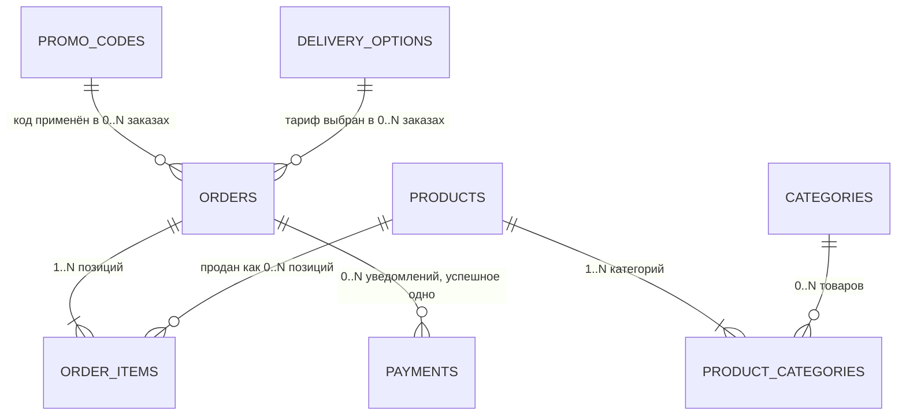

# База данных

Шаг 3 чертежа. Источники: `idea/` целиком, `architecture/01-что-строим.md`, `architecture/02-сущности.md`, `00-правила-проекта.md`, решения владельца из `README.md`, факты о доставке и ценах из `.business/products/pricing.md`. Сверка со сделанным: прототип `prototypes/2026-09-09-katalog/js/data.js`, макет `mockups/v1-scenariy-1/index.html`.

Шаг 2 дал словарь: что за вещи и как связаны. Здесь - таблицы, поля, типы, индексы, ограничения и правила миграций. Готовая схема - в `architecture/schema.prisma`, она сгенерирована из этого файла, а не наоборот.

**Решения владельца от 12.09.2026, заложены в схему как факт:**

1. остаток товара в первой версии не ведём - поля остатка нет;
2. выгоду по промокоду округляем **вниз до рубля**, все суммы в копейках;
3. повторяем SMS текущего сайта: после оплаты и после отгрузки с трек-номером. Значит у Заказа есть состояние «отгружен» и поле трек-номера;
4. возвраты целиком на стороне CloudPayments - таблицы возвратов нет;
5. при исчерпании лимита кода поднимаем лимит того же кода, второй код не выпускаем.

Всё, чего нет в источниках, помечено ⚠️ и не считается фактом.

## 1. На чём строим и почему

### 1.1 Форма хранения

| Вариант | Плюс | Минус | Итог |
|---|---|---|---|
| **Реляционная база (таблицы)** ✅ | деньги, связи и обязательные поля проверяет сама база; заказ без источника и второй платёж по одной транзакции физически не создать | нужна миграция на каждое изменение формы | выбрано |
| Документная база (MongoDB и подобные) | форму меняешь на лету | «заказ не может ссылаться на несуществующего клиента» приходится проверять кодом; при всплеске после ролика достаточно одной дырки в коде, чтобы получить кривой заказ | отклонено |
| Таблицы в файлах или в git | дёшево | одновременная запись заказов ломается сразу | отклонено |

Данных здесь сотни строк, а не миллионы (`01-что-строим.md`, раздел 8). Поэтому выбираем не по скорости - по строгости: цена ошибки в деньгах и в атрибуции выше, чем стоимость лишней миграции.

### 1.2 Какая именно база

**PostgreSQL 16** на сервере в РФ. Провайдер выбирается на шаге 5 «Стек» вместе с ценами, но движок решается здесь, потому что от него зависят типы полей и ограничения.

Почему Postgres, а не MySQL и не SQLite:

- **частичные индексы и частичная уникальность.** «У заказа не больше одного успешного платежа» - это одна строчка в Postgres и самодельная проверка кодом в MySQL. Правило 5 из `00-правила-проекта.md` («повторный вебхук не создаёт второй платёж») хочется выполнить базой, а не надеждой;
- **ограничения-проверки (CHECK)** работают по-настоящему: «итого = товары - выгода + доставка» база не даст нарушить;
- **массивы строк** закрывают состав и выгоды товара без двух лишних таблиц;
- **SQLite отпадает** из-за одновременной записи при всплеске после ролика;
- размещение в РФ обязательно (152-ФЗ), а Postgres есть у всех российских провайдеров - это не сужает выбор на шаге 5.

Доступ из кода - через **Prisma**: она уже заложена в защитный hook проекта, даёт понятные миграции в git и типы в TypeScript.

### 1.3 Общие соглашения

| Решение | Как именно | Почему |
|---|---|---|
| Имена | модели в коде - `Product`, таблицы в базе - `products`, поля - `snake_case` | `order` в SQL - служебное слово, таблица называется `orders` |
| Время | всегда `timestamptz`, храним в UTC, показываем в московском | сервер и покупатель могут стоять в разных поясах |
| Деньги | целые копейки, поле всегда кончается на `_kopecks` | правило 5; по имени поля видно единицу измерения |
| Идентификатор | строковый `cuid` у всех таблиц | заказ №1042 - для человека, `cuid` - для машины; по чужому заказу нельзя подобрать соседний |
| Валюта | не храним | все расчёты в рублях; поле валюты появится, если появится вторая |
| Удаление | только мягкое, полем `deleted_at` | правило «Запрещено»: удаление только пометкой |

## 2. Карта таблиц

Семь таблиц. Сезон таблицей не стал: он лежит в конфиге (решение шага 2, раздел 5.3).

| Таблица | Про что | Кто её меняет | Как часто читают |
|---|---|---|---|
| `products` | 19 позиций каталога | редактор руками в базе | на каждой странице, кэшируется |
| `categories` | пять линеек | почти никогда | на каждой странице, кэшируется |
| `product_categories` | какой товар в какой линейке | вместе с товаром | вместе с каталогом |
| `promo_codes` | код ролика: источник, выгода, лимит, срок | редактор при выходе ролика | при каждой проверке кода в корзине |
| `delivery_options` | семь тарифов корзины | когда СДЭК меняет цены | на шаге оформления |
| `orders` | оформленные покупки: деньги, контакты, источник | сервер | отчёты и поддержка |
| `order_items` | строки заказа | сервер, вместе с заказом | вместе с заказом |
| `payments` | уведомления CloudPayments | сервер, обработчик вебхука | при разборе оплат |

Первые пять - читающая часть, её кэшируем. Последние три - пишущая. Это ровно то разделение, которого требует пункт 10.7 из `01-что-строим.md`: всплеск после ролика должен упираться в кэш каталога, а не в базу.

## 3. Таблицы по одной

Обозначения: **обяз.** - поле не может быть пустым; *необяз.* - может.

### 3.1 `products` - Товар

Одна из 19 позиций каталога: средство или готовый набор.

| Поле | Тип | Обяз. | Что это |
|---|---|---|---|
| `id` | текст (cuid) | обяз. | внутренний номер записи |
| `slug` | текст, уникальный | обяз. | короткое имя для адреса: `stop-akne` |
| `name` | текст | обяз. | «Бокс „Стоп акне“» |
| `sku` | текст | обяз. | артикул `4Y252D08`, его называют в переписке |
| `price_kopecks` | целое | обяз. | 199 000 = 1 990 ₽ |
| `tagline` | текст | обяз. | «От акне, постакне, дерматита и купероза» |
| `contents` | список строк | обяз. | состав: «Крем ОЗОДЕРМИК 3% - 80 мл», … |
| `benefits` | список строк | обяз. | три строки выгод на карточке |
| `badge` | перечисление | *необяз.* | `HIT` / `BESTSELLER` / пусто |
| `image_key` | текст | *необяз.* | ключ файла в хранилище, не сама картинка (раздел 7) |
| `image_alt` | текст | *необяз.* | подпись для незрячих и для поиска |
| `image_width`, `image_height` | целые | *необяз.* | чтобы страница не прыгала при загрузке |
| `sort_order` | целое | обяз. | порядок в каталоге, по умолчанию 100 |
| `is_published` | да/нет | обяз. | показывать ли на сайте, по умолчанию нет |
| `deleted_at` | время | *необяз.* | заполнено - записи как будто нет |
| `created_at`, `updated_at` | время | обяз. | когда завели и когда меняли |

**Чего здесь нет и почему:**

- **остатка** - решение владельца от 12.09.2026: в первой версии не ведём;
- **старой зачёркнутой цены** - решение от 12.09 и правило 6 из `principles.md`;
- **ссылки на карточку Tilda** - адрес нового сайта строится из `slug`;
- **самой картинки** - в базе только ключ файла, байты в объектном хранилище (раздел 7).

**Почему состав и выгоды - список строк, а не отдельная таблица.** Это текст для показа на карточке: по нему не ищут, не фильтруют и не считают. Отдельная таблица дала бы два лишних запроса и ни одной новой возможности. Когда начнём считать остатки по флаконам, состав станет связью «набор - его части» - это отдельная задача и отдельная миграция (`02-сущности.md`, раздел 4).

**Разница между «скрыт» и «удалён».** `is_published = нет` - товар готовят или сняли с продажи, он вернётся. `deleted_at` заполнено - товара больше нет нигде, но заказы прошлого года на него по-прежнему ссылаются. Это два разных факта, поэтому два разных поля.

### 3.2 `categories` - Категория

Линейка каталога. Пять строк: лицо, волосы, тело, масло, наборы.

| Поле | Тип | Обяз. | Что это |
|---|---|---|---|
| `id` | текст (cuid) | обяз. | внутренний номер |
| `slug` | текст, уникальный | обяз. | `face`, `hair`, `body`, `oils`, `sets` |
| `title` | текст | обяз. | «Лицо» |
| `sort_order` | целое | обяз. | порядок в фильтре |
| `deleted_at` | время | *необяз.* | мягкое удаление |
| `created_at`, `updated_at` | время | обяз. | |

«Хиты» сюда не входят: это фильтр по полю `badge` товара, а не линейка (`02-сущности.md`, 3.2). «Подарочное» из `01-что-строим.md` и «Наборы» из прототипа - одно и то же, принято имя **Наборы** (`sets`).

Заодно чиним баг прототипа: категория `oils` стояла у масла «Отри 6000», но в список фильтров не попала. В справочнике она есть.

### 3.3 `product_categories` - связь товара и линейки

Таблица из двух ссылок: какой товар в какой линейке. У «Стоп акне» здесь две строки - лицо и наборы.

| Поле | Тип | Обяз. | Что это |
|---|---|---|---|
| `product_id` | ссылка на `products` | обяз. | |
| `category_id` | ссылка на `categories` | обяз. | |

Ключ - пара полей: один и тот же товар нельзя положить в одну линейку дважды. Удаление товара уносит его строки связи (связь без товара бессмысленна), а категорию нельзя стереть, пока в ней есть товары.

### 3.4 `promo_codes` - Промокод

Код из ролика или директа, он же запись об источнике. У ролика ровно один код (решение владельца от 12.09.2026), поэтому поля ролика лежат здесь.

| Поле | Тип | Обяз. | Что это |
|---|---|---|---|
| `id` | текст (cuid) | обяз. | внутренний номер |
| `code` | текст, уникальный | обяз. | `OSEN-R1`, всегда заглавными и без пробелов |
| `platform` | перечисление | обяз. | `INSTAGRAM`, `TELEGRAM`, `VK`, `OZON`, `WB`, `YANDEX`, `SITE`, `UNKNOWN` |
| `video_title` | текст | обяз. | «Reels „Осенняя кожа“ от 12.09» - это читает Рафаэль |
| `video_date` | дата | обяз. | дата выхода ролика |
| `utm_content` | текст | *необяз.* | `reels-1209` - запасной способ узнать источник |
| `discount_percent` | целое 1..100 | обяз. | 10 |
| `usage_limit` | целое > 0 | обяз. | 200 |
| `valid_until` | дата | обяз. | последний день действия, включительно |
| `is_disabled` | да/нет | обяз. | выключен руками, по умолчанию нет |
| `note` | текст | *необяз.* | заметка для себя |
| `deleted_at` | время | *необяз.* | мягкое удаление |
| `created_at`, `updated_at` | время | обяз. | |

**Код всегда хранится заглавными буквами.** Покупатель наберёт `osen-r1`, `Osen-R1` или скопирует с пробелом в конце. Приводим к одному виду при записи и при поиске, а база дополнительно не пускает строчные буквы: иначе рано или поздно появятся два кода `OSEN-R1` и `osen-r1`, и лимит ролика размажется по двум строкам.

**Сколько раз код использован - не поле, а счёт по заказам.** Развилка разобрана в 4.2. Коротко: считаем оплаченные и отгруженные заказы с этим кодом. Брошенная корзина лимит ролика не съедает, а счётчик не может разойтись с действительностью.

**Состояния не хранятся** - вычисляются из даты, лимита и флага (решение шага 2, 5.4):

| Состояние | Как получается |
|---|---|
| действует | `valid_until` не прошла, заказов с кодом меньше лимита, `is_disabled` = нет |
| срок вышел | сегодня позже `valid_until` |
| лимит исчерпан | число оплаченных заказов с кодом равно `usage_limit` |
| выключен | `is_disabled` = да |

При исчерпании лимита поднимаем `usage_limit` того же кода (решение владельца от 12.09.2026). Второй код того же ролика не выпускаем - ролик остался бы в отчёте двумя строками.

### 3.5 `delivery_options` - Вариант доставки

Семь тарифов корзины ровно как на ozonbox.ru на 12.09.2026.

| Поле | Тип | Обяз. | Что это |
|---|---|---|---|
| `id` | текст (cuid) | обяз. | |
| `slug` | текст, уникальный | обяз. | `pvz`, `door`, `kz`, `by_pvz`, `by_door`, `intl1`, `intl2` |
| `title` | текст | обяз. | «Центральная часть РФ, пункт СДЭК» |
| `price_kopecks` | целое | обяз. | 45 000 = 450 ₽ |
| `sort_order` | целое | обяз. | порядок в списке |
| `is_enabled` | да/нет | обяз. | показывать ли в корзине |
| `deleted_at` | время | *необяз.* | мягкое удаление |
| `created_at`, `updated_at` | время | обяз. | |

Тариф для России вне центральной части не заводим: его нет в сегодняшней корзине магазина, и придумывать цену за владельца нельзя.

### 3.6 `orders` - Заказ

Главная таблица проекта. Здесь сходятся деньги, персональные данные и источник.

**Кто и куда**

| Поле | Тип | Обяз. | Что это |
|---|---|---|---|
| `id` | текст (cuid) | обяз. | внутренний номер |
| `number` | целое, уникальное | обяз. | номер для человека: 1042. Выдаёт счётчик базы, начиная с 1000 |
| `customer_name` | текст | почти | имя получателя |
| `customer_phone` | текст | почти | телефон в виде `+79101369031` |
| `customer_email` | текст | почти | для чека |
| `address_line` | текст | почти | адрес одной строкой с индексом - ровно как в корзине магазина |

«Почти обязательно» значит: заполнено всегда, кроме заказов, у которых персональные данные стёрли по требованию человека. Тогда все четыре поля пустеют разом и проставляется `personal_data_erased_at`. Наполовину стёртого заказа база не допускает.

**Доставка**

| Поле | Тип | Обяз. | Что это |
|---|---|---|---|
| `delivery_option_id` | ссылка | обяз. | выбранный тариф |
| `delivery_title_snapshot` | текст | обяз. | его название на момент заказа |
| `delivery_price_kopecks` | целое | обяз. | его цена на момент заказа |

Снимок нужен, потому что СДЭК поменяет цену, а заказ должен остаться правдой.

**Деньги (всё в копейках, целыми)**

| Поле | Что это |
|---|---|
| `items_total_kopecks` | сумма товаров |
| `discount_kopecks` | выгода по коду, округлённая **вниз до рубля** (решение от 12.09.2026) |
| `delivery_price_kopecks` | доставка |
| `total_kopecks` | итого к оплате |

База не даст записать заказ, у которого `итого ≠ товары - выгода + доставка`, и заказ, где выгода больше суммы товаров.

**Про округление.** Считаем в копейках: 289 300 × 10% = 28 930 копеек, округляем вниз до целого рубля - 28 900 копеек (289 ₽). Ровно та цифра, что показывал макет. Округление вниз выбрано потому, что округление вверх - это выгода за счёт магазина, а «вниз» покупателю не обидно: он видит ту же сумму, что и в корзине.

**Откуда пришёл заказ**

| Поле | Тип | Обяз. | Что это |
|---|---|---|---|
| `source_platform` | перечисление | обяз. | площадка, по умолчанию `UNKNOWN` |
| `utm_source` | текст | *необяз.* | метка из ссылки |
| `utm_content` | текст | *необяз.* | метка ролика из ссылки |
| `source_video_title` | текст | *необяз.* | название ролика снимком |
| `promo_code_id` | ссылка | *необяз.* | код, если его ввели и он действовал |
| `promo_code_snapshot` | текст | *необяз.* | сам код строкой |
| `discount_percent_snapshot` | целое | *необяз.* | сколько процентов дал код |

Поле площадки нельзя оставить пустым: если источник неизвестен, туда пишется `UNKNOWN`, и заказ попадает в отчёт как проблема (правило «Всегда» 1). Отдельного флага «источник неизвестен» не заводим: `UNKNOWN` и есть флаг, и он не может разойтись с остальными полями.

Снимок кода хранится **вместе** со ссылкой, а не вместо неё: код могут выключить, переименовать или пометить удалённым, а заказ обязан помнить, с чем его оплатили. База следит, чтобы ссылка и снимок были заполнены парой - либо оба, либо ни одного.

**Юридика**

| Поле | Тип | Обяз. | Что это |
|---|---|---|---|
| `offer_accepted_at` | время | обяз. | когда принял оферту |
| `privacy_accepted_at` | время | обяз. | когда согласился на обработку данных |
| `marketing_consent` | да/нет | обяз. | согласие на рассылку - отдельной галочкой |
| `legal_docs_version` | текст | обяз. | версия документов, например `2026-09-12` |

Два согласия - два поля. Они и на экране разные галочки (`principles.md`, правило 5). Версия документов нужна, чтобы через год было видно, что именно человек принимал.

**Состояние и учёт отправок**

| Поле | Тип | Обяз. | Что это |
|---|---|---|---|
| `status` | перечисление | обяз. | `AWAITING_PAYMENT` → `PAID` → `SHIPPED` |
| `paid_at` | время | *необяз.* | когда пришло подтверждение оплаты |
| `shipped_at` | время | *необяз.* | когда отгрузили |
| `track_number` | текст | *необяз.* | трек СДЭК |
| `telegram_notified_at` | время | *необяз.* | когда ушло сообщение Рафаэлю |
| `sms_paid_sent_at` | время | *необяз.* | когда ушла SMS об оплате |
| `sms_shipped_sent_at` | время | *необяз.* | когда ушла SMS с треком |
| `personal_data_erased_at` | время | *необяз.* | когда стёрли контакты по требованию человека |
| `created_at`, `updated_at` | время | обяз. | |

Три состояния вместо двух - решение владельца от 12.09.2026: первая версия повторяет SMS текущего сайта, а SMS с трек-номером некому отправить, пока заказ не стал отгруженным. Переходы только вперёд: ждёт оплаты → оплачен → отгружен. Назад база не пускает.

Три поля «когда отправлено» устроены одинаково и нужны для одного: повторный запуск отправки не шлёт второе сообщение. Пусто - не отправляли, заполнено - отправили, и это видно в базе, а не в логах.

Состояний «отклонён банком», «оплата обрабатывается», «брошен» и «возврат» нет специально - разобрано в `02-сущности.md`, 3.5. Возвраты по решению владельца от 12.09.2026 целиком у CloudPayments.

### 3.7 `order_items` - Позиция заказа

Одна строка заказа: что и почём куплено.

| Поле | Тип | Обяз. | Что это |
|---|---|---|---|
| `id` | текст (cuid) | обяз. | |
| `order_id` | ссылка | обяз. | к какому заказу |
| `product_id` | ссылка | обяз. | какой товар |
| `product_name_snapshot` | текст | обяз. | название на момент заказа |
| `product_sku_snapshot` | текст | обяз. | артикул на момент заказа |
| `unit_price_kopecks` | целое | обяз. | цена за штуку тогда |
| `quantity` | целое > 0 | обяз. | сколько штук |
| `line_total_kopecks` | целое | обяз. | цена × количество |

Один товар в заказе встречается не больше одного раза: две штуки - это `quantity = 2`, а не две строки. База это проверяет.

Снимки названия, артикула и цены - не дублирование. «Цена товара сейчас» и «за сколько продано тогда» - разные величины, и вторая обязана остаться неизменной, иначе заказ разойдётся с суммой платежа (`02-сущности.md`, 3.6).

### 3.8 `payments` - Платёж

Одно уведомление от CloudPayments.

| Поле | Тип | Обяз. | Что это |
|---|---|---|---|
| `id` | текст (cuid) | обяз. | |
| `order_id` | ссылка | обяз. | к какому заказу |
| `cp_transaction_id` | текст | обяз. | номер транзакции у CloudPayments |
| `kind` | перечисление | обяз. | `CHECK` - проверка до списания, `PAY` - деньги списаны, `FAIL` - банк отказал |
| `amount_kopecks` | целое | обяз. | сумма уведомления |
| `reason` | текст | *необяз.* | причина отказа словами от банка |
| `received_at` | время | обяз. | когда уведомление пришло к нам |
| `created_at` | время | обяз. | |

**Здесь живёт защита от двойного списания.** Пара «номер транзакции + вид уведомления» уникальна. CloudPayments при сбое связи повторяет вебхук; вторая запись просто не создастся, и обработчик поймёт, что это повтор. Это не осторожность кода, а ограничение базы - ровно то, чего требует правило 5.

Плюс второе ограничение: у одного заказа не больше одного уведомления `PAY`. Даже ошибка в коде не сможет оплатить заказ дважды.

**Чего здесь нет никогда:** номера карты, срока, CVV, любых их частей и сырого текста уведомления целиком. Карту видит только виджет CloudPayments (правило «Запрещено»). Сырой текст не храним, потому что в нём приезжают поля, которые нам не нужны, а хранить лишнее про плательщика - значит отвечать за него.

### 3.9 Сезон - конфиг, а не таблица

Решение шага 2 (5.3) не меняется: тексты сцены, подборка товаров и медиа лежат в файле конфига в git. Вместе с сезоном приезжают видеофайлы, то есть выкат всё равно нужен, а конфиг виден в ревью и откатывается одной командой.

Чем это оплачивается: база не может проверить, что `slug` товара из осенней подборки существует. Поэтому при сборке запускается проверка - все `slug` из конфига сезона есть в каталоге и опубликованы. Нет - сборка падает. Это замена ссылочной целостности для той части, что живёт вне базы.

## 4. Развилки: что сравнивали и что выбрали

### 4.1 Товар и линейки: список в товаре или отдельная таблица связи

| Вариант | Плюс | Минус |
|---|---|---|
| Список строк прямо в товаре (`cats: ['face','sets']`, как в прототипе) | одна таблица | база не знает, что `oils` - опечатка, и фильтр молча пуст. Ровно это и случилось в прототипе |
| Поле-перечисление | проверка значений есть | у товара их несколько, одним полем не обойтись |
| **Отдельная таблица связи** ✅ | база не даст поставить несуществующую линейку; подписи и порядок меняются без выката | лишнее соединение при чтении, на 19 товарах незаметное |

### 4.2 «Сколько раз код использован»: хранить числом или считать по заказам

| Вариант | Плюс | Минус |
|---|---|---|
| Поле-счётчик в промокоде | видно одним взглядом | два источника правды. Счётчик и заказы разойдутся при любой ошибке, и никто этого не заметит; придётся отдельно решать, считать ли брошенные корзины |
| **Считать оплаченные заказы с этим кодом** ✅ | расхождение невозможно в принципе; брошенная корзина не съедает лимит ролика | на каждую проверку кода - счёт по заказам |

Выбран второй, и это то же решение, что шаг 2 принял для состояний кода (5.4): не хранить то, что можно посчитать. «Цена» - счёт по индексу на сотнях строк, это микросекунды, и результат всё равно кэшируется.

⚠️ **Это уточняет словарь шага 2**, где «сколько раз использован» стояло полем (`02-сущности.md`, 3.4). Смысл не изменился, изменился способ хранения - шаг 3 как раз про это. Заодно решается вопрос, который в словаре не был задан: **лимит расходуют оплаченные заказы, а не оформленные**.

Честная оговорка: если двадцать человек одновременно оформят заказ последним из оставшихся использований, лимит можно перешагнуть на несколько штук. Для магазина это безобидно - неверный код и так не блокирует покупку (решение 3А), а из двух зол «дать выгоду лишним троим» дешевле, чем блокировать корзину на время проверки.

### 4.3 Деньги: копейки целым числом, дробь или отдельный денежный тип

| Вариант | Плюс | Минус |
|---|---|---|
| **Целое число копеек** ✅ | ничего не теряется при сложении; правило 5 требует буквально этого | нужно помнить про множитель 100, поэтому имя поля кончается на `_kopecks` |
| Дробное число (float) | привычно | 0,1 + 0,2 ≠ 0,3, и однажды итог разойдётся с платежом на копейку |
| Тип «деньги» с двумя знаками | точно | в коде превращается в объект, суммы всё равно считаются копейками |

Обычного целого хватает до 21 миллиона рублей в одном поле - при чеке 899-4 999 ₽ запас четырёхзначный.

### 4.4 Номера: один на всё или отдельно для людей и для машин

| Вариант | Плюс | Минус |
|---|---|---|
| Сквозной счётчик 1, 2, 3 как единственный номер | просто | по ссылке на свой заказ покупатель подберёт чужой; из номеров видно, сколько всего было заказов |
| Только случайный `cuid` | не подберёшь | «назовите номер заказа» превращается в диктовку 25 символов |
| **Оба: `cuid` внутри, счётчик с 1000 для человека** ✅ | и не подберёшь, и по телефону называется | два поля вместо одного |

Счёт начинается с 1000, чтобы первый заказ не назывался «№1»: это разговор с покупателем, а не отчёт.

### 4.5 Источник заказа: отдельные колонки или один блок данных

| Вариант | Плюс | Минус |
|---|---|---|
| **Отдельные колонки: площадка, метки, ролик, код** ✅ | отчёт по каналам - обычный запрос с группировкой и индексом | при добавлении метки нужна миграция |
| Один блок (JSON) «источник» | новые метки без миграции | прямо запрещено в `01-что-строим.md`, п. 9: источник хранится разборным; по блоку не сделать быстрый отчёт |

`utm_medium` и `utm_campaign` добавим, когда появятся платные кампании Яндекса. Это одна миграция на два поля, а не переделка.

### 4.6 Удаление: стирать, прятать или переносить в архив

| Вариант | Плюс | Минус |
|---|---|---|
| **Пометка `deleted_at` + запрос по умолчанию её не видит** ✅ | заказы прошлого года не ломаются; правило «удаление только мягкое» выполнено | нужно помнить про условие в каждом запросе - закрываем одним слоем доступа к данным |
| Стирать по-настоящему | база чище | заказ ссылается на несуществующий товар, история продаж рассыпается. Прямо запрещено правилами |
| Архивная таблица-двойник | основная таблица чистая | две формы одной вещи, миграции надо делать дважды |

**Заказы и платежи не удаляются вообще**, даже мягко: это денежные и налоговые записи. Требование человека «удалите мои данные» выполняется иначе - стираются четыре поля контактов и ставится `personal_data_erased_at`. Сумма, состав и канал остаются: это факты о продаже, а не о человеке.

### 4.7 Уведомления об оплате: одна запись на транзакцию или на каждое уведомление

| Вариант | Плюс | Минус |
|---|---|---|
| Уникальность по номеру транзакции | совсем просто | CloudPayments по одной транзакции шлёт сначала проверку, потом оплату. Второе уведомление не запишется, и мы потеряем факт оплаты |
| **Уникальность по паре «транзакция + вид уведомления»** ✅ | повтор любого вида отсекается, разные виды сохраняются | на один платёж может быть две-три строки |

### 4.8 Картинки: в базе или в файловом хранилище

Выбрано хранилище, в базе только ключ и описание - раздел 7. Байты в базе раздувают резервные копии в десятки раз и заставляют отдавать картинку через приложение вместо отдачи напрямую.

## 5. Что ищем чаще всего и какие от этого индексы

Индекс - это оглавление: без него база читает все строки подряд. Ставим ровно там, где продукт спрашивает часто.

| Что делает продукт | Запрос | Индекс |
|---|---|---|
| Открыть витрину | опубликованные, неудалённые товары по порядку | `products`: частичный по `sort_order` при `is_published` и не удалён |
| Открыть карточку товара | найти товар по адресу | `products`: уникальный по `slug` |
| Фильтр по линейке | товары одной категории | `product_categories`: по `category_id` |
| Фильтр «Хиты» | товары с бейджем | `products`: частичный по `badge`, только где он есть |
| Проверить код в корзине | найти код по тексту | `promo_codes`: уникальный по `code` |
| Проверить лимит кода | сколько оплаченных заказов с этим кодом | `orders`: по паре `promo_code_id` + `status` |
| Список тарифов доставки | включённые по порядку | `delivery_options`: частичный по `sort_order` при `is_enabled` |
| Отчёт по каналам (сцена 2) | заказы по площадке за период | `orders`: по паре `source_platform` + `created_at` |
| Найти заказы-проблемы | заказы с площадкой `UNKNOWN` | тот же индекс по площадке |
| Отправить неотправленное в Telegram и SMS | оплаченные заказы без отметки об отправке | `orders`: частичный по `paid_at`, только где отметка пуста |
| Поддержка ищет заказ | по номеру или по телефону | `orders`: уникальный по `number`, обычный по `customer_phone` |
| Открыть заказ целиком | позиции и платежи заказа | `order_items`: по `order_id`; `payments`: по `order_id` |
| Обработать вебхук | не приходило ли это уведомление раньше | `payments`: уникальный по паре «транзакция + вид» |

Чего специально **не** индексируем: состав и выгоды товара (по ним не ищут), адрес и имя покупателя (поиск по ним - редкий разбор вручную, индекс стоил бы дороже пользы). Полнотекстовый поиск по каталогу в первой версии не нужен: 19 позиций помещаются на экран.

## 6. Правила, которые в базе нельзя нарушить

Не пожелания к коду - ограничения самой базы. Попытка записать неправильное заканчивается ошибкой.

**Ссылки**

1. Заказ ссылается только на существующий тариф доставки, позиция - только на существующий заказ и существующий товар, платёж - только на существующий заказ, связь - только на существующие товар и категорию.
2. Товар, категорию и тариф нельзя стереть, пока на них ссылаются заказы. Такие записи только помечаются удалёнными.
3. Заказ уносит свои позиции, если его когда-нибудь всё же убирают (без заказа они бессмысленны), но заказы не убираются вовсе.
4. Промокод нельзя стереть, пока на него ссылается заказ.

**Обязательность**

5. У каждой записи есть собственный номер (`id`), и он никогда не меняется.
6. У заказа обязательно заполнены: номер для человека, площадка источника, тариф доставки со снимком названия и цены, все четыре суммы, оба времени согласий, версия документов и состояние.
7. Площадка источника не может быть пустой. Неизвестен - значит `UNKNOWN`, и такой заказ виден в отчёте как проблема.
8. Заказа без позиций не бывает: пустой заказ создать нельзя (проверяется при создании, одной транзакцией с позициями).

**Уникальность**

9. Адрес товара (`slug`), адрес категории, адрес тарифа, текст промокода и номер заказа для человека - каждый встречается ровно один раз.
10. Пара «транзакция CloudPayments + вид уведомления» уникальна: повторный вебхук не создаёт второй платёж.
11. У заказа не больше одного успешного платежа.
12. Один товар входит в заказ не больше одного раза и в одну категорию не больше одного раза.

**Числа и деньги**

13. Все суммы - целые копейки и не могут быть отрицательными.
14. `итого = товары - выгода + доставка`. Иначе запись не пройдёт.
15. Выгода не больше суммы товаров.
16. Выгода кратна 100 копейкам - следствие округления вниз до рубля.
17. Количество в позиции больше нуля, а `сумма строки = цена × количество`.
18. Процент выгоды у кода - от 1 до 100, лимит использований больше нуля.

**Согласованность состояний**

19. Оплачен - значит есть время оплаты. Отгружен - значит есть и время отгрузки, и трек-номер.
20. Есть ссылка на промокод - значит есть и его снимок, и процент. Нет ссылки - нет и снимка.
21. Персональные данные либо на месте целиком, либо стёрты целиком вместе с отметкой о стирании. Полустёртого заказа не бывает.
22. Текст промокода хранится только заглавными буквами.

**Что база проверить не может и это остаётся на коде**

- переходы состояний только вперёд (ждёт оплаты → оплачен → отгружен);
- совпадение суммы уведомления CloudPayments с суммой заказа;
- подпись вебхука;
- существование товаров из конфига сезона - проверяется при сборке (3.9);
- «удалённое не попадает в обычные запросы» - условие «`deleted_at` пусто» живёт в одном слое доступа к данным, а не переписывается в каждом месте.

Это не дыры, а честная граница: база отвечает за форму данных, код - за порядок действий.

## 7. Большие файлы: картинки и видео

**Правило одно: в базе - ссылка и описание, байты - в файловом хранилище.**

**Где лежат файлы.** Объектное хранилище с S3-совместимым доступом у российского провайдера (Yandex Object Storage, Selectel, VK Cloud) - конкретный выбирается на шаге 5 вместе с ценой. Раздаются файлы через CDN, то есть страница берёт картинку не у нашего приложения.

**Что лежит в базе:**

| Для чего | Поля |
|---|---|
| Фото товара | `image_key` (ключ файла), `image_alt` (подпись), `image_width`, `image_height` |
| Медиа сезона | в конфиге сезона: ключ видео, ключ постера, описание CSS-заглушки |

Размеры хранятся ради скорости: браузер заранее знает место под картинку и не дёргает страницу при загрузке - это прямо влияет на бюджет LCP из правила 4.

**Как устроены имена файлов.** `products/stop-akne/a1b2c3d4.webp`, `seasons/autumn/scene-01.mp4`. В имени - короткое имя товара и отпечаток содержимого. Поэтому файл никогда не перезаписывается: новая картинка - новое имя, старая ссылка продолжает работать, а кэш можно ставить вечный.

**Почему не в базе.**

| Вариант | Почему отклонён |
|---|---|
| Байты картинки в поле базы | резервная копия вырастает с мегабайт до гигабайт, восстановление становится долгим; каждую картинку отдаёт приложение, а не CDN - это прямо против бюджета скорости |
| Картинка в виде текста (base64) в поле | то же самое плюс треть лишнего веса |
| Файлы рядом с кодом в репозитории | 19 фото ещё поместятся, осенние видео - нет; git не для медиа |

**Что при этом теряем:** база не знает, существует ли файл по ключу. Лечится проверкой при сборке: все ключи из каталога и конфига сезона должны быть в хранилище. Файл убирается из хранилища только отдельным шагом после того, как ссылка на него убрана, и не раньше, иначе на сайте появится битая картинка.

**В базу не кладём никогда:** документы покупателей, сканы, чеки. Чек живёт у CloudPayments (54-ФЗ).

## 8. Как менять базу дальше и не потерять данные

Простыми словами - шесть правил.

**1. Одно изменение - один шаг.** Каждая правка формы базы оформляется отдельной миграцией: у неё своя дата, своё имя («добавили трек-номер»), и она лежит в git. Двадцать правок одним файлом невозможно ни проверить, ни откатить.

**2. Применённый шаг не переписываем.** Если миграция уже выполнена на боевом сервере, её файл трогать нельзя - даже опечатку. Исправление оформляется следующей миграцией. Иначе у разработчика и на сервере окажутся разные базы, которые считают себя одинаковыми.

**3. Убрать поле - в два захода.** Сначала выкатываем код, который в это поле не пишет и из него не читает, и убеждаемся, что всё работает. Только потом, отдельной миграцией и следующим выкатом, поле убирается из схемы. Если сделать это сразу, старая версия приложения ещё живёт несколько секунд и падает на каждом запросе.

**4. Переименование - это три шага, а не один.** Добавили новое поле → скопировали данные и стали писать в оба → выкатили код на новое поле → убрали старое. Прямое переименование - это «убрать» и «добавить» одновременно, то есть пункт 3, нарушенный дважды.

**5. Новое обязательное поле - тоже в два захода.** Сначала поле добавляется необязательным (или со значением по умолчанию), затем заполняется у старых строк, и только потом становится обязательным. Иначе миграция упадёт на первой же существующей строке.

**6. Перед изменением боевой базы - резервная копия, и проверенная.** Копия, которую ни разу не разворачивали, копией не считается.

**Чего не делаем никогда** (это же ловит защитный hook `.claude/hooks/guard.mjs`):

- команды Prisma, пересоздающие базу с нуля (`migrate reset`, `db push` с принудительным сбросом) - они стирают всё;
- ручные команды, убирающие таблицу целиком или очищающие её, и удаление строк без условия;
- применение миграций командой для разработки. На боевом - только `prisma migrate deploy`, которая ничего не пересоздаёт.

**Справочные данные** - пять категорий и семь тарифов доставки - заливаются отдельным скриптом-наполнителем, который можно запускать сколько угодно раз: он обновляет существующие строки по `slug` и добавляет недостающие, но ничего не убирает.

**Индексы на живой базе** добавляются в отдельной миграции способом, который не блокирует таблицу (`CREATE INDEX CONCURRENTLY`). На сотнях строк это незаметно, но привычку заводим сразу.

## 9. Чем этот шаг уточнил шаг 2

| Было в `02-сущности.md` | Стало здесь | Почему |
|---|---|---|
| у Промокода поле «сколько раз использован» | поля нет, считается по оплаченным заказам | 4.2: два источника правды разойдутся; заодно решено, что лимит тратят оплаченные, а не оформленные заказы |
| у Заказа два состояния, отгрузки нет | три состояния, есть `shipped_at` и трек-номер | решение владельца от 12.09.2026: повторяем SMS текущего сайта |
| «предложение: округлять вниз» ⚠️ | округление вниз до рубля - правило и ограничение базы | решение владельца от 12.09.2026 |
| остаток товара - открытый вопрос ⚠️ | поля остатка нет | решение владельца от 12.09.2026 |
| возвраты - открытый вопрос ⚠️ | таблицы возвратов нет | решение владельца от 12.09.2026: возвраты у CloudPayments |
| у Заказа «признак источник неизвестен» | отдельного признака нет, признак - значение `UNKNOWN` | иначе два поля об одном могут разойтись |
| у Платежа «исход: успех / отказ» | вид уведомления `CHECK` / `PAY` / `FAIL` | 4.7: по одной транзакции приходит несколько уведомлений разного вида |

Словарь шага 2 при этом не переписываем: он описывает вещи, а не поля. Расхождения перечислены здесь и в журнале решений.

## 10. Что этот шаг обязан выдержать

Сверка с требованиями из `01-что-строим.md`, п. 10:

1. **Заказа без источника не бывает** - площадка обязательна, по умолчанию `UNKNOWN`, проверяет база (п. 7 раздела 6).
2. **Деньги целыми копейками, повторный вебхук не создаёт второй платёж** - целые поля с проверками, уникальность пары «транзакция + вид», не больше одного успешного платежа на заказ.
3. **Текст поверх видео** - в базе только данные, медиа - ключи файлов; сцена читается без видео.
4. **Сезон - конфиг** - смена сезона не трогает ни одну таблицу.
5. **ПДн в РФ, наружу обезличенное** - контакты только в `orders`, стираются по требованию человека, в Telegram уходят номер, сумма, состав, код и канал.
6. **Чтение отделено от записи** - пять справочных таблиц кэшируются, три пишущие не кэшируются.
7. **Рост предусмотрен, но не построен** - лимит 1 даёт одноразовые коды; новая площадка - значение в перечислении; Кампания выделяется из Промокода одной миграцией, заказы не трогая; вторая картинка товара - отдельная таблица без переделки существующей.

## 11. Открытые вопросы

Ничто из этого не мешает написать первую миграцию.

1. ⚠️ **Кто отправляет SMS.** Решение от 12.09 - SMS повторяем, поля отправки в базе есть. Каким сервисом шлём (тем же, что у текущего сайта, или другим) - вопрос шага 6 «Внешние сервисы».
2. ⚠️ **Провайдер базы и хранилища файлов в РФ** - выбирается на шаге 5 «Стек» вместе с ценами.
3. ⚠️ **Срок хранения персональных данных.** Закон требует не хранить их дольше, чем нужно. Предложение: через год после отгрузки контакты стираются автоматически, деньги и источник остаются. Нужно решение владельца, но не сейчас - к запуску.

## 12. Журнал решений

1. **PostgreSQL, а не документная база** - деньги и обязательный источник должна проверять сама база, а не код (1.1, 1.2).
2. **Семь таблиц, сезон в конфиге** - продолжение решения шага 2 (5.3); вместе с сезоном приезжают видеофайлы, выкат всё равно нужен.
3. **Отдельная таблица связи товара и линейки** - прототип уже словил на себе цену обратного решения: категория `oils` была опечаткой без фильтра (4.1).
4. **Использования кода считаем, а не храним** - тот же принцип, что у состояний кода на шаге 2: не хранить вычислимое (4.2).
5. **Все суммы - целые копейки** - правило 5 из `00-правила-проекта.md`; выгода округляется вниз до рубля (решение владельца от 12.09.2026).
6. **Два номера у заказа** - чтобы номер можно было назвать по телефону и нельзя было подобрать чужой (4.4).
7. **Источник разборными колонками** - требование `01-что-строим.md`, п. 9: отчёт по каналам должен быть запросом, а не разбором строки (4.5).
8. **Мягкое удаление везде, заказы не убираются вовсе** - правило «Запрещено»; требование человека о стирании данных выполняется стиранием четырёх полей контактов (4.6).
9. **Уникальность по паре «транзакция + вид уведомления»** - CloudPayments шлёт по одной транзакции несколько уведомлений; уникальность только по номеру транзакции потеряла бы факт оплаты (4.7).
10. **Файлы в объектном хранилище, в базе ключ и описание** - резервная копия остаётся лёгкой, картинки раздаёт CDN, а не приложение (раздел 7).

**Решение: выбрал такую структуру базы - семь таблиц с разборным источником у заказа, снимками цен и тарифа внутри заказа, вычисляемыми состояниями кода и уникальностью по уведомлению CloudPayments, - потому что она делает саму базу сторожем трёх вещей, на которых стоит проект: заказ не может появиться без источника, деньги не могут разойтись с платежом, а повторный вебхук не может списать второй раз; всё остальное в этой идее (сезоны, админка, отчёты, второй сайт) добавляется миграцией, не трогая заказы.**

**Дата:** 2026-09-12
