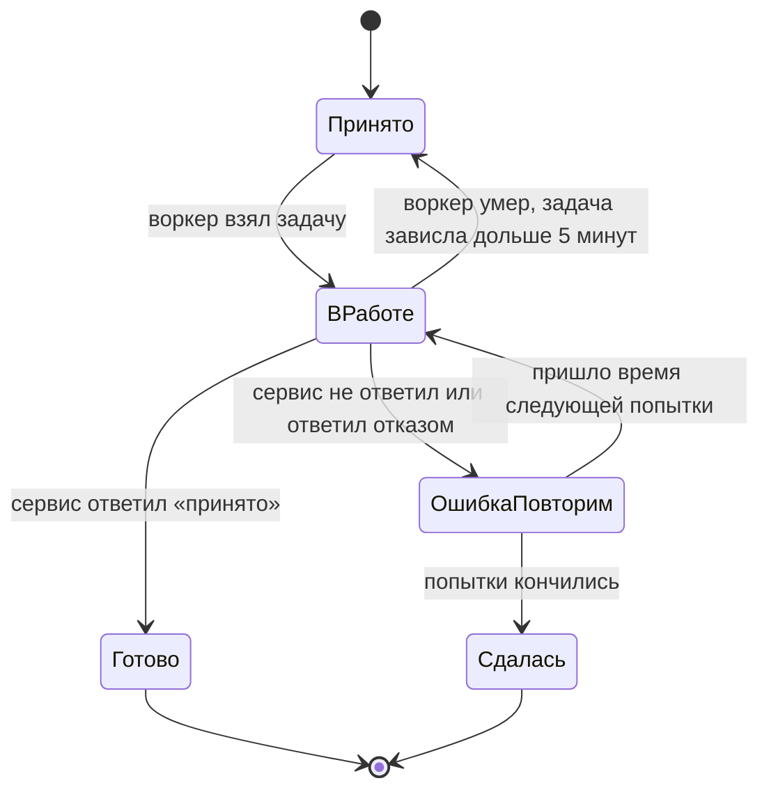
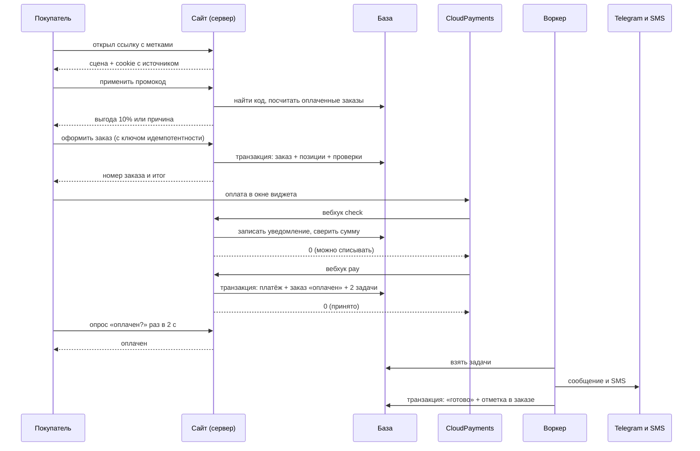

# Потоки данных

Шаг 4 чертежа. Источники: `idea/` целиком, `architecture/01-что-строим.md`, `02-сущности.md`, `03-база-данных.md`, `00-правила-проекта.md`, решения владельца из `README.md`. Сверка со сделанным: макет `mockups/v1-scenariy-1/index.html` (шесть шагов сквозного сценария, пять состояний у каждого).

Шаги 1-3 ответили, **что** мы храним. Здесь - **когда что происходит**: на какие события продукт реагирует, что человек видит за секунды, что уходит в фон, как устроена очередь и что происходит, когда работа срывается.

Решения владельца, заложенные как факт: видео-скраббинг со текстом HTML поверх видео и сцена, работающая без видео; оплата через виджет CloudPayments, повторный вебхук не создаёт второй платёж; SMS покупателю после оплаты и после отгрузки с трек-номером; сообщение в Telegram только об оплаченных заказах и без персональных данных; источник заказа - из utm-меток ссылки, иначе `unknown`, и такой заказ помечается в отчёте как проблема.

Всё, чего нет в источниках, помечено ⚠️ и не считается фактом.

## 1. Правило, по которому делим работу

В этом продукте нет ни одной задачи, которая долго считается. Каталог - 19 позиций, заказ - несколько строк, промокод - один запрос по индексу. Тяжёлое здесь не вычисления, а **зависимость от чужого сервера**.

Поэтому граница проходит не по «быстро или медленно», а вот так:

| | Лёгкая работа | Тяжёлая работа |
|---|---|---|
| Что трогает | только нашу базу и наш кэш | чужой сервер (Telegram, SMS-шлюз) или файл |
| Сколько длится | предсказуемо, десятки миллисекунд | непредсказуемо: от 200 мс до «сервис лежит час» |
| Кто ждёт | человек смотрит в экран | никто не ждёт |
| Что если сорвалось | показываем ошибку и даём повторить | повторяем сами, человека не трогаем |
| Где делается | в том же запросе | в очереди задач |

**Из этого правила следует главное решение шага.** Обработчик вебхука CloudPayments не имеет права звонить в Telegram и в SMS-шлюз. CloudPayments ждёт от нас быстрый ответ; если мы отвечаем медленно, он считает уведомление недоставленным и присылает его снова. Тогда медленный Telegram превращается в поток повторных вебхуков - то есть сбой чужого сервиса ломает нам учёт денег. Поэтому вебхук делает только записи в базу и отвечает, а сообщения уходят отдельно.

### Что выглядит тяжёлым, но остаётся лёгким

| Работа | Почему не в фон |
|---|---|
| Проверка промокода | это два запроса к своей базе: найти код и посчитать оплаченные заказы с ним. Человек стоит и смотрит на кнопку «применить» - ответ нужен сразу |
| Создание заказа | одна транзакция: заказ, позиции, проверки. Покупатель обязан увидеть номер и итоговую сумму **до** оплаты, иначе он платит непонятно за что |
| Перевод заказа в «оплачен» | от этой отметки зависит экран покупателя и вся дальнейшая цепочка. Уводить её в фон - значит не знать, оплачен ли заказ |

### Что выглядит лёгким, но уходит в фон

| Работа | Почему в фон |
|---|---|
| Сообщение в Telegram | одна строка кода и чужой сервер, который может быть недоступен. Ради этого сообщения затевался проект, но покупатель его не ждёт |
| SMS покупателю | то же самое плюс деньги на счету шлюза, которые могут кончиться |

## 2. События, на которые продукт реагирует

Пятнадцать поводов. Пять - действия покупателя, четыре - уведомления CloudPayments, два - ошибки, два - действия владельца и расписание, два - гонки и повторы.

| № | Событие простыми словами | Откуда приходит | Что человек видит сразу | Что уходит в фон |
|---|---|---|---|---|
| 1 | Пришёл по ссылке из директа с метками | браузер | сцену сезона | ничего: метки кладутся в cookie тем же ответом |
| 2 | Скроллит сцену, а видео не загрузилось | браузер | ту же сцену на фото и CSS-фоне, весь текст на месте | ничего |
| 3 | Нажал «в корзину» | браузер | товар в корзине мгновенно, сервер не участвует | ничего |
| 4 | Ввёл промокод и нажал «применить» | браузер → сервер | выгоду 10% или причину отказа, до 1 с | ничего |
| 5 | Нажал «оформить заказ» | браузер → сервер | номер заказа и итог, 1-2 с, затем окно оплаты | ничего |
| 6 | Нажал «оформить» ещё раз: двойной клик или повтор запроса от сети | браузер → сервер | **тот же** номер заказа, не второй заказ | ничего |
| 7 | Закрыл окно оплаты, не заплатив | виджет | корзину и заказ на месте, кнопку «оплатить» снова | ничего |
| 8 | CloudPayments спрашивает «можно списывать?» (`check`) | вебхук | «оплата обрабатывается» | ничего: отвечаем за миллисекунды |
| 9 | CloudPayments сообщил «деньги списаны» (`pay`) | вебхук | «оплачено», номер заказа | две задачи: сообщение в Telegram, SMS покупателю |
| 10 | Банк отказал (`fail`) | вебхук | «банк отказал, попробуйте другую карту» | ничего |
| 11 | Тот же вебхук пришёл второй раз | вебхук | ничего не меняется | ничего: база не даст создать второй платёж |
| 12 | Экран «спасибо» открыт, а вебхука ещё нет | время | «оплата обрабатывается», опрос до 30 с, потом честную надпись | ничего |
| 13 | Задача отправки сорвалась: Telegram или шлюз недоступны | очередь | ничего: покупателя это не касается | повтор по расписанию, после пяти попыток - «сдалась» |
| 14 | Владелец отметил заказ отгруженным и ввёл трек-номер | защищённая форма | заказ «отгружен» | задача: SMS с трек-номером |
| 15 | Сработало расписание: прошли 15 минут, наступило утро | планировщик | ничего | добор незавершённых задач, сверка зависших оплат, утренняя строка о проблемах |

### Чего в этом списке нет специально

| Событие | Почему не автоматизируем в первой версии |
|---|---|
| Смена сезона 1 декабря | вместе с сезоном приезжают видеофайлы, то есть выкат всё равно нужен. Это не событие продукта, а выкат руками (`02-сущности.md`, 5.3) |
| Возврат денег | целиком у CloudPayments, решение владельца от 12.09.2026 |
| Человек попросил стереть свои данные | делается руками по регламенту: четыре поля контактов разом плюс отметка. Автоматизировать удаление персональных данных по письму из интернета нельзя - личность надо проверить |
| Брошенная корзина | состояния «брошен» нет (`02-сущности.md`, 3.5), письма и SMS брошенным корзинам не шлём: на это нет согласия |
| Товар кончился | остатки в первой версии не ведём, решение владельца от 12.09.2026 |

## 3. Лёгкая работа: что человек видит за секунды

Шесть шагов макета с временем ответа. Бюджет из правила 4: LCP на мобильном до 2,5 с.

| Шаг | Что делает сервер | Бюджет | Что видно, пока идёт работа |
|---|---|---|---|
| Открыть сцену или каталог | отдаёт заранее собранную страницу; данные каталога из кэша | LCP до 2,5 с | ничего не ждём: текст и фото приходят сразу, видео подгружается после и только для видимой сцены |
| Фильтр по линейке | ничего: фильтрация уже загруженных 19 позиций в браузере | мгновенно | - |
| Положить в корзину | ничего: корзина живёт в браузере (`02-сущности.md`, раздел 4) | мгновенно | - |
| Применить промокод | найти код по индексу, посчитать оплаченные заказы с ним | до 300 мс | кнопка «применить» в состоянии ожидания, не дольше секунды |
| Оформить заказ | одна транзакция: проверить код заново, посчитать суммы, записать заказ, позиции и задачи | до 1,5 с | кнопка заблокирована, надпись «создаём заказ» |
| Получить параметры для виджета оплаты | прочитать заказ, собрать данные виджета | до 300 мс | окно CloudPayments открывается сразу |
| Узнать, оплачен ли заказ | прочитать состояние заказа | до 200 мс | «оплата обрабатывается», опрос раз в 2 с |

**Каталог и сцена кэшируются, заказ - никогда.** Это прямое следствие пункта 10.7 из `01-что-строим.md`: всплеск после ролика должен упираться в кэш каталога, а не в базу. Читающие таблицы (`products`, `categories`, `product_categories`, `delivery_options`) отдаются из кэша страницы; `promo_codes` кэшируется на минуту; `orders`, `order_items`, `payments` читаются и пишутся только напрямую.

**Промокод проверяется дважды: при нажатии «применить» и внутри транзакции создания заказа.** Первая проверка - для человека, вторая - для денег. Между ними могут пройти минуты, за которые срок кода истечёт или лимит исчерпается. Итоговая выгода считается второй проверкой, и именно она попадает в заказ.

## 4. Тяжёлая работа: очередь задач

### 4.1 Что в очереди

Три вида задач. Больше в первой версии нет.

| Задача | Когда ставится | Что делает | Отметка «сделано» |
|---|---|---|---|
| Сообщение в Telegram об оплаченном заказе | той же транзакцией, что и отметка «оплачен» | шлёт номер, сумму, состав, код, канал. Без имени, телефона и адреса | `orders.telegram_notified_at` |
| SMS покупателю «заказ оплачен» | той же транзакцией | шлёт короткий текст с номером заказа | `orders.sms_paid_sent_at` |
| SMS покупателю с трек-номером | когда владелец отметил отгрузку | шлёт трек-номер СДЭК | `orders.sms_shipped_sent_at` |

**Задача пишется той же транзакцией, что и отметка «оплачен».** Или в базе есть и оплата, и задача, или нет ни того, ни другого. Если ставить задачу после ответа CloudPayments, найдётся заказ, который оплачен, а сообщение о нём не ушло никогда и никто об этом не узнал.

### 4.2 Состояния задачи



| Состояние | Что значит человеческими словами | Что дальше |
|---|---|---|
| **принято** | задача записана, её ещё никто не брал | воркер возьмёт в следующие секунды |
| **в работе** | воркер взял задачу и сейчас звонит в чужой сервис | либо готово, либо ошибка |
| **готово** | сервис подтвердил приём, отметка в заказе поставлена | ничего, задача больше не тронется |
| **ошибка, повторим** | сервис не ответил или отказал, назначено время следующей попытки | попытка по расписанию |
| **сдалась** | попытки кончились, нужен человек | попадает в утреннюю строку в Telegram |

Шестого состояния - «отменена» - нет: отменять отправку сообщения об уже случившейся оплате незачем.

«Ошибка, повторим» - это то же «принято», но со временем запуска в будущем. Держим отдельным состоянием ради одного: человек, который откроет таблицу задач, должен видеть слово «ошибка», а не вычислять его из двух полей. Никакого второго источника правды здесь нет: и то и другое - одна запись.

### 4.3 Ошибка на каждом шаге

| Шаг | Что может сорваться | Что делает система | Что видит покупатель | Что видит владелец |
|---|---|---|---|---|
| Задача не записалась | упала транзакция вебхука | ответ CloudPayments «не принято», он пришлёт уведомление снова | «оплата обрабатывается» | ничего, пока не придёт повтор |
| Задачу никто не взял | воркер не запущен | расписание раз в 5 минут само добирает задачи | ничего | утреннюю строку, если задачи висят |
| Задача зависла «в работе» | воркер убили посреди работы | через 5 минут возвращается в «принято» | ничего | ничего |
| Telegram отказал | бот заблокирован, токен сменился, сеть | «ошибка, повторим», пять попыток | ничего | сообщение приходит позже |
| SMS-шлюз отказал | нет денег на счету, неверный номер | «ошибка, повторим», три попытки | не получает SMS | утреннюю строку |
| Попытки кончились | сервис лежит часами | «сдалась», отметка в заказе не ставится | не получает SMS | утреннюю строку и запись в базе |
| Задача сделана, а отметка не записалась | база отказала после успешной отправки | задача останется в «в работе», повтор возможен | может получить вторую SMS | ничего |

Последняя строка - единственное место, где возможна лишняя SMS. Закрываем её тем, что отметка ставится **в той же транзакции**, что и перевод задачи в «готово»: либо оба факта, либо ни одного. Остаётся щель на стороне шлюза: он мог принять SMS и не ответить нам. Здесь выбор явный - **лучше лишняя SMS, чем ни одной**: покупатель, заплативший деньги и не получивший подтверждения, звонит и волнуется, а второе одинаковое сообщение всего лишь раздражает. Если шлюз умеет принимать наш собственный номер сообщения для защиты от повторов - используем его (вопрос шага 6).

### 4.4 Сколько раз повторяем

| Задача | Попыток | Задержки | Почему столько |
|---|---|---|---|
| Telegram об оплате | 5 | 30 с, 2 мин, 10 мин, 1 ч, 4 ч | ради этого сообщения затевался проект; повтор ничего не стоит, потому что от второго сообщения защищает отметка в заказе |
| SMS об оплате | 3 | 1 мин, 10 мин, 1 ч | каждая попытка стоит денег и может дойти до человека дважды |
| SMS с треком | 3 | 1 мин, 10 мин, 1 ч | то же |

Задержки растут, а не повторяются каждую секунду: если чужой сервис лёг, частыми попытками мы только добавим ему нагрузки и забьём свою очередь.

### 4.5 Как воркер берёт задачу

Одна операция, которая одновременно находит задачу, помечает её взятой и считает попытку:

```sql
UPDATE jobs
   SET status = 'RUNNING', locked_at = now(), attempts = attempts + 1
 WHERE id IN (
       SELECT id FROM jobs
        WHERE status IN ('QUEUED', 'RETRY')
          AND run_after <= now()
        ORDER BY run_after
        FOR UPDATE SKIP LOCKED
        LIMIT 10
 )
RETURNING *;
```

`SKIP LOCKED` - это то, ради чего на шаге 3 выбран PostgreSQL: два воркера физически не могут взять одну задачу, и договариваться им не нужно. Отдельно проверяем зависших: задачи в «в работе» с `locked_at` старше 5 минут возвращаются в «принято».

### 4.6 Таблица задач - уточнение к шагу 3

Восьмая таблица, которой в `03-база-данных.md` нет. Это добавление, а не переделка: ни одна существующая таблица не меняется.

| Поле | Тип | Обяз. | Что это |
|---|---|---|---|
| `id` | текст (cuid) | обяз. | внутренний номер |
| `kind` | перечисление | обяз. | `TELEGRAM_ORDER_PAID`, `SMS_ORDER_PAID`, `SMS_ORDER_SHIPPED` |
| `order_id` | ссылка на `orders` | обяз. | по какому заказу |
| `dedup_key` | текст, уникальный | обяз. | `вид + номер заказа`: второй такой задачи не создать |
| `status` | перечисление | обяз. | `QUEUED`, `RUNNING`, `RETRY`, `DONE`, `DEAD` |
| `attempts` | целое | обяз. | сколько попыток сделано, по умолчанию 0 |
| `max_attempts` | целое > 0 | обяз. | сколько попыток разрешено |
| `run_after` | время | обяз. | не раньше этого момента, по умолчанию `now()` |
| `locked_at` | время | *необяз.* | когда воркер взял задачу |
| `last_error` | текст | *необяз.* | что ответил сервис в последний раз |
| `created_at`, `updated_at`, `done_at` | время | | |

Индексы: частичный по `run_after` только для `QUEUED` и `RETRY` (воркер спрашивает только про них); по `order_id` (открыть все задачи заказа); частичный по `updated_at` для `DEAD` (утренняя строка).

Ограничения: `dedup_key` уникален; `DONE` - значит `done_at` заполнено; `attempts` не больше `max_attempts`; удаление заказа уносит его задачи, но заказы не удаляются вовсе.

**Почему `dedup_key`, а не просто пара полей.** Дедупликация по паре «вид + заказ» - это и есть уникальность, но в одном текстовом поле её видно глазами при разборе и она не развалится, когда появится задача, не привязанная к заказу (например, будущий еженедельный отчёт).

**Задачи не удаляются, а стареют.** Выполненные задачи старше 90 дней убираются отдельным заданием - это единственное место в проекте, где мы стираем строки по-настоящему, и стирать там нечего: в задаче нет ни денег, ни персональных данных, только вид, номер заказа и время.

### 4.7 Отметка в заказе и состояние задачи - разные факты

Оба существуют, и это не два источника правды:

- `orders.telegram_notified_at` - **факт о заказе**: «сообщение о нём ушло». Это то, что нужно знать про заказ, и это уже заложено в шаге 3 вместе с индексом «оплаченные заказы без отметки об отправке».
- `jobs.status` - **факт о процессе**: «как шла отправка, сколько было попыток, что ответил сервис». Это нужно знать про отправку, а не про заказ.

Та же разница, что между `is_published` и `deleted_at` у товара или между состоянием заказа и уведомлениями CloudPayments. Воркер перед отправкой читает отметку в заказе: если она уже стоит, задача сразу становится «готово» и никуда не звонит. Получается две защиты от второго сообщения: уникальный `dedup_key` при постановке и отметка в заказе при выполнении.

### 4.8 Где живёт воркер

| Вариант | Плюс | Минус |
|---|---|---|
| **Функция «обработать пачку задач», которую зовёт либо постоянный процесс рядом с приложением, либо расписание по защищённому адресу** ✅ | работает и на своём сервере, и на бессерверном хостинге: выбор стека на шаге 5 не переделывает очередь | на бессерверном варианте задержка до следующего шага расписания |
| Только постоянный процесс | задачи идут сразу | привязывает шаг 4 к решению шага 5, которого ещё нет |
| Готовая библиотека очередей (graphile-worker, pg-boss) | повторы и блокировки написаны не нами | приносит свою схему в нашу базу и свои привычки; на трёх видах задач выигрыш нулевой |
| Redis и BullMQ | привычно и быстро | ещё один сервис, ещё деньги, ещё точка отказа. Хуже другое: задачу нельзя записать той же транзакцией, что и оплату, - появится «оплачен, а задачи нет» |

Выбран первый. **Точка переключения назначена заранее:** если видов задач станет больше пяти или понадобятся расписания внутри задачи, переходим на `graphile-worker` - выбрасывается таблица задач, заказы и платежи не трогаются.

## 5. Путь заказа целиком



Три границы на этой картинке важнее всего:

1. **Между покупателем и оплатой** нет нашего сервера: данные карты идут прямо в виджет CloudPayments (правило «Запрещено»).
2. **Между вебхуком и отправкой сообщений** стоит база: вебхук только пишет, воркер только читает. Медленный Telegram не может задержать ответ CloudPayments.
3. **Между покупателем и фоновой работой** нет связи: он не ждёт ни Telegram, ни SMS. Экран «спасибо» показывается по состоянию заказа, а не по успеху отправки.

## 6. Четыре развилки, которые требовалось решить

### 6.1 Как узнаём, что внешний результат готов: спрашиваем сами или нам сообщают

Ответ разный для разных сервисов, и это правильный ответ, а не уклончивый.

| Что ждём | Вариант | Плюс | Минус |
|---|---|---|---|
| Оплата | Опрашивать CloudPayments раз в N секунд по всем неоплаченным | не зависим от того, дошло ли до нас уведомление | десятки лишних запросов на каждый заказ; задержка до шага опроса; CloudPayments всё равно шлёт уведомления, мы бы их игнорировали |
| Оплата | Только вебхук | ноль лишних запросов, узнаём в тот же миг | если вебхук не дошёл вовсе (наш сервер лежал, адрес сменился), деньги списаны, а мы об этом не знаем никогда |
| Оплата | **Вебхук как основной способ, опрос как страховка для зависших** ✅ | обычный путь моментальный и без лишних запросов; редкий случай «уведомление не дошло» всё равно ловится | два пути вместо одного, оба должны быть идемпотентны - а они уже идемпотентны по уникальности «транзакция + вид» |

**Выбран третий: вебхук основной, опрос страховочный** - потому что уведомление приносит факт о деньгах, а деньги нельзя «не заметить»: заказы, висящие «ждёт оплаты» дольше 15 минут, сверяются с CloudPayments по номеру заказа.

| Что ждём | Решение | Причина одной фразой |
|---|---|---|
| Telegram и SMS | ответ на наш же запрос, никаких обратных вызовов | сервис отвечает «принято» в том же соединении, ждать нечего |
| Экран покупателя после оплаты | браузер опрашивает **наш** сервер раз в 2 с, не больше 30 с | ради одного экрана на 30 секунд постоянное соединение или серверные события - это отдельная инфраструктура вместо десяти строк кода |
| Успех оплаты по сигналу из браузера | **не доверяем** | обратный вызов виджета живёт в браузере, а браузеру верить нельзя: наш адрес может позвать кто угодно. Оплаченным заказ делает только подписанный вебхук |

После 30 секунд опроса, если вебхука всё ещё нет, экран говорит правду: «Банк принял оплату. Подтверждение придёт SMS в течение нескольких минут». Не «ошибка» - деньги с карты уже ушли, и врать про ошибку хуже всего.

### 6.2 Как не сделать одно и то же дважды при повторном клике

| Вариант | Плюс | Минус |
|---|---|---|
| Заблокировать кнопку в браузере | видно человеку, ноль кода на сервере | не защита: мобильный браузер повторяет POST при потере сети, кнопка при этом не нажималась |
| Искать похожий заказ: тот же телефон и тот же состав за 5 минут | ничего не нужно от браузера | догадка о поведении: человек, честно заказавший второй такой же набор, получит отказ |
| **Ключ идемпотентности: браузер выдаёт один опознавательный номер на открытие шага оформления, база держит его уникальным** ✅ | повтор возвращает **тот же** номер заказа; проверяет база, а не код | нужно поле и одна миграция |

**Выбран третий - потому что повторный запрос должен вернуть тот же заказ, а не отказ, и это единственный вариант, где правило соблюдает база, а не надежда на браузер.**

Как работает: при открытии шага оформления браузер создаёт случайный номер и держит его до успеха. Сервер пишет его в `orders.idempotency_key` с уникальным индексом. Второй запрос с тем же ключом натыкается на уникальность, сервер читает уже созданный заказ и возвращает его как есть. Человек видит один номер заказа, сколько бы раз он ни нажал.

Где ключ **не нужен:** положить в корзину (сервер не участвует), применить промокод (только чтение, ничего не меняет), открыть окно оплаты (читаем существующий заказ).

⚠️ **Уточнение к шагу 3:** у `orders` появляется поле `idempotency_key` (текст, уникальный, обязательный) - одна миграция.

### 6.3 Как не списать оплату дважды

Четыре защиты, три из них - ограничения базы, а не код. Двойное списание дороже любой другой ошибки в этом проекте, поэтому одной защиты здесь мало.

| Слой | Что делает | Кто следит |
|---|---|---|
| 1. Одна оплата - один номер счёта | в виджет уходит `invoiceId` = номер заказа. Повторное открытие окна оплаты для того же заказа - тот же номер счёта и та же сумма | код |
| 2. Оплаченный заказ нельзя оплатить снова | если заказ уже `PAID`, сервер не отдаёт параметры для виджета вовсе: показывает «этот заказ уже оплачен» | код |
| 3. Повторный вебхук не создаёт второй платёж | уникальность пары «транзакция CloudPayments + вид уведомления»; на повтор отвечаем «принято», чтобы CloudPayments перестал присылать | **база** (`03-база-данных.md`, 4.7) |
| 4. У заказа не больше одного успешного платежа | частичная уникальность по `PAY` | **база** |
| 5. Сумма уведомления сверяется с суммой заказа | не сошлась - на `check` отвечаем отказом, то есть **деньги не списываются вообще**; на `pay` не помечаем оплаченным и ставим задачу «разобраться» | код |

**Причина одной фразой: списать дважды должно быть физически невозможно, поэтому две главные защиты - это уникальные индексы, которые не обойти даже ошибкой в коде.**

Самый ценный здесь слой 5 на уведомлении `check`: это единственная точка, где мы можем остановить списание **до** того, как деньги ушли. Поэтому обработчик `check` не делает ничего, кроме чтения заказа и сравнения суммы, - он обязан быть самым простым кодом в проекте.

Гонка двух уведомлений (`check` и `pay` пришли одновременно) закрывается блокировкой строки заказа на время обработки: второй обработчик ждёт первого, а не работает рядом с ним.

### 6.4 Где хранить большой готовый файл

| Вариант | Плюс | Минус |
|---|---|---|
| **Объектное хранилище в РФ с раздачей через CDN, в базе - ключ файла** ✅ | приложение не касается байтов; резервная копия базы остаётся лёгкой; кэш вечный, потому что имя файла содержит отпечаток содержимого | база не знает, существует ли файл, - проверяем при сборке |
| Файл отдаёт наше приложение | один сервис вместо двух | прямо против бюджета скорости: каждый килобайт видео идёт через приложение. На всплеске после ролика это первое, что ляжет |
| Файлы в репозитории рядом с кодом | ничего не нужно подключать | 19 фото поместятся, осенние видео - нет; git не для медиа |
| Байты в базе | всё в одном месте | резервная копия растёт с мегабайт до гигабайт, восстановление становится долгим |

Решение продолжает раздел 7 шага 3 и не меняется. **Причина одной фразой: покупатель должен брать видео у ближайшего сервера раздачи, а не у нашего приложения, иначе бюджет LCP не выполняется ни при каком коде.**

Что добавляет шаг 4 к этому решению - **когда** файл готовится:

| Файл | Кто и когда готовит | Ждёт ли человек |
|---|---|---|
| Фото товара (19 штук) | один раз, до выката, руками; размеры записываются в базу | нет |
| Видео сцены и постер | вместе с сезоном, до выката; проверка «все ключи из конфига есть в хранилище» на сборке | нет |
| Выгрузка заказов, будущие отчёты | по запросу владельца, в тот же бакет под закрытым префиксом, ссылка со сроком жизни | ⚠️ не первая версия |

**В первой версии нет ни одного файла, который покупатель ждёт.** Это честный итог: «обработка файла в фоне, чтобы человек не ждал» - типовая задача, но у нас тяжёлый файл ровно один, сезонное видео, и оно приезжает вместе с выкатом. Придумывать для него очередь означало бы построить механизм, который никогда не запустится на покупателе.

## 7. Ещё три развилки, без которых поток не собирается

### 7.1 Где живёт источник до создания заказа

Человек может прийти по ссылке из директа сегодня, а купить через три дня. Метки должны доехать до сервера в момент создания заказа.

| Вариант | Плюс | Минус |
|---|---|---|
| **Cookie первой стороны, закрытая для скриптов, 30 дней** ✅ | едет с каждым запросом сама; сервер читает её при создании заказа; страница не может её подделать | требует упоминания в политике cookie |
| `localStorage` в браузере | не считается cookie | её надо явно приложить к запросу, то есть верить браузеру; в приватном режиме и после чистки теряется |
| Серверная сессия | надёжно | ради двух меток появляется хранилище сессий и вопрос «а это персональные данные?» |
| Передавать метки в адресе до самого оформления | ничего не храним | ломается о первую же внутреннюю ссылку и о возврат из виджета оплаты |

**Причина одной фразой: источник - ядро проекта, и он обязан доехать до сервера сам, без участия страницы, иначе заказ станет `unknown` из-за одного перехода по внутренней ссылке.**

Что в cookie: `utm_source`, `utm_content`, время первого визита. Ничего о человеке. Первое касание не перетирается вторым: если человек пришёл из Reels, а потом вернулся из поиска, источником остаётся Reels - он привёл покупателя.

### 7.2 Что становится источником заказа, когда сигналов несколько

Порядок жёсткий и один на весь проект:

| Приоритет | Сигнал | Почему так |
|---|---|---|
| 1 | Промокод, введённый в корзине | человек набрал его руками - это самый сильный сигнал, какой вообще бывает |
| 2 | Метки `utm_source` и `utm_content` из cookie | ссылка из директа или из поста |
| 3 | Ответ на необязательный вопрос «как вы о нас узнали» на шаге оформления | человек мог прийти из Reels три дня назад через встроенный браузер Instagram, а купить уже из обычного Safari - это другой браузерный контекст, и cookie первой стороны физически не переживает такой переход (`09-риски.md`, причина 2). Варианты - `Instagram`, `Ozon`, `Wildberries`, `Поиск`, `Знакомые`, `Другое`; поле необязательное и не блокирует оформление |
| 4 | `UNKNOWN` | сигналов нет вообще ни одного из трёх; заказ помечается в отчёте как проблема (правило «Всегда» 1) |

⚠️ **Отдельный случай, которого нет в шагах 1-3: код назван, но не сработал.** Срок вышел или лимит исчерпан. Покупка не блокируется (решение 3А), выгода равна нулю - но **канал-то известен**: этот код человек получил из конкретного ролика.

| Вариант | Плюс | Минус |
|---|---|---|
| **Записать источник из кода, выгоду не давать** ✅ | ролик получает свой заказ в отчёте; ради этого проект и делается | в заказе остаётся ссылка на код, по которому не было выгоды |
| Считать источником только метки | проще | заказ уедет в `UNKNOWN`, хотя мы точно знаем канал. Это прямо против ядра из `vision.md` |

Признак «код применён» не хранится отдельным полем, а вычисляется: есть ссылка на код **и** выгода больше нуля. Меньшая цена промокода в каталоге - 899 ₽, десять процентов от неё никогда не округлятся вниз до нуля, так что признак однозначен.

Код, которого в базе нет вовсе (опечатка), источником стать не может: ссылку ставить некуда, а хранить набранный текст без связи запрещает ограничение шага 3 («ссылка и снимок заполнены парой»). ⚠️ Предложение: не хранить его нигде - это опечатка, а не канал.

⚠️ **Уточнение к шагу 3:** `orders.discount_percent_snapshot` может быть нулём (код назван, выгоды нет), хотя у самого кода процент всегда от 1 до 100.

### 7.3 Кто переводит заказ в «отгружен»

Здесь чертёж сам себе противоречит, и это надо назвать прямо: `01-что-строим.md` говорит «админки нет и отгрузку первая версия не ведёт», а решение владельца от 12.09.2026 и шаг 3 дают заказу состояние «отгружен», трек-номер и SMS с ним. Кто-то должен это состояние ставить.

| Вариант | Плюс | Минус |
|---|---|---|
| **Одна защищённая страница: номер заказа + трек-номер + кнопка «отгружено»** ✅ | это не админка, а один экран на два поля; закрывает решение владельца без нарушения «админки нет» | всё равно нужен вход и защита |
| Команда в консоли сервера | ноль кода | Рафаэль не будет заходить на сервер, а значит SMS с треком не уйдёт никогда |
| Ответ боту в Telegram | удобно владельцу | бот должен научиться принимать команды и проверять, кто пишет, - это больше работы, чем один экран |
| Ничего не делать в первой версии | честно по `01-что-строим.md` | решение владельца «SMS с трек-номером повторяем» останется невыполненным |

**Предложение: одна защищённая страница.** Поток работает и без неё: если трек-номер никто не ввёл, заказ остаётся «оплачен», SMS с треком не уходит, и ничего не ломается. ⚠️ Нужно решение владельца: делаем этот экран в первой версии или SMS с треком переносится в «потом» вместе с админкой.

## 8. События по времени: расписание

Четыре задания. Все устроены одинаково: защищённый адрес, который зовёт внешний планировщик, или системный таймер рядом с приложением - что окажется в стеке на шаге 5.

| Когда | Что делает | Зачем |
|---|---|---|
| Каждую минуту | обрабатывает пачку задач очереди | основной ход очереди на бессерверном хостинге; на своём сервере это делает постоянный процесс, а расписание остаётся страховкой |
| Каждые 5 минут | ищет оплаченные заказы без отметки об отправке и без живой задачи, ставит задачи заново; возвращает зависших «в работе» | защита от «оплачен, а сообщение не ушло и задачи нет» |
| Каждые 15 минут | берёт заказы «ждёт оплаты» старше 15 минут и спрашивает CloudPayments, не списаны ли деньги | единственный способ узнать про оплату, уведомление о которой не дошло |
| 9:00 МСК | если есть сдавшиеся задачи или заказы с источником `UNKNOWN` за сутки - **одна строка** в Telegram | правило 3 из `principles.md`: Рафаэль получает одну цифру, а не отчёт на десять экранов |

**Утренняя строка молчит, когда всё хорошо.** Ежедневное «всё в порядке» перестают читать через неделю, и тогда настоящая проблема тоже останется непрочитанной.

Еженедельного отчёта по каналам здесь нет: это сцена 2, вырезанная из первой версии (`01-что-строим.md`, раздел 5). Механизм для неё уже готов - расписание и очередь, - но саму задачу не пишем.

## 9. Чем этот шаг уточнил шаги 1-3

| Было | Стало здесь | Почему |
|---|---|---|
| семь таблиц | восемь: добавилась `jobs` | очередь нужна отдельной записью: отметка в заказе хранит факт «ушло», а не попытки и ошибки (4.6, 4.7) |
| у `orders` нет защиты от двойного оформления | поле `idempotency_key`, уникальное | 6.2: повтор должен вернуть тот же заказ, и следить за этим должна база |
| `discount_percent_snapshot` - процент кода | может быть нулём | 7.2: истёкший код всё равно записывается источником, выгоды при этом нет |
| «отгружен» есть, кто ставит - не сказано | предложена одна защищённая страница ⚠️ | 7.3: без неё решение владельца про SMS с треком невыполнимо |
| «источник из utm-меток» | метки живут в cookie первой стороны 30 дней, первое касание не перетирается | 7.1: человек покупает не в тот же заход |
| «админки нет, отгрузку не ведём» (шаг 1) против «есть трек-номер и SMS» (шаг 3) | противоречие названо, предложен минимальный выход | этого расхождения не замечал ни один из предыдущих шагов |
| источник заказа - два уровня (код, cookie) | добавлен третий уровень: необязательный вопрос «как вы о нас узнали» на форме оформления, `UNKNOWN` сдвинут на четвёртый | 13.09.2026, `09-риски.md`, причина 2: cookie не переживает переход между браузерным контекстом Instagram и обычным Safari, а промокод необязателен - нужна страховка, не зависящая от браузера. ⚠️ Уточнение к шагу 3: у `orders` появляется необязательное поле `source_answer` (текст, одно из перечисления) |

Шаги 1-3 не переписываем: расхождения перечислены здесь и в журнале решений, поля добавляются миграциями.

## 10. Что этот шаг обязан выдержать

Сверка с требованиями из `01-что-строим.md`, п. 10:

1. **Заказа без источника не бывает** - источник приезжает в cookie и в промокоде, приоритет жёсткий, `UNKNOWN` попадает в утреннюю строку (7.1, 7.2, раздел 8).
2. **Повторный вебхук не создаёт второй платёж, двойного списания нет** - пять слоёв защиты, два из них уникальные индексы (6.3).
3. **Текст поверх видео, сцена без видео** - страница читается до загрузки видео, видео подгружается после и только для видимой сцены (раздел 3).
4. **Сезон - конфиг** - смена сезона не событие продукта, а выкат; ни одна задача и ни одна таблица при этом не меняются (раздел 2).
5. **Персональные данные в РФ, наружу обезличенное** - в Telegram уходят номер, сумма, состав, код и канал; телефон видит только SMS-шлюз, и только сам номер (4.1).
6. **Чтение отделено от записи** - каталог и сцена из кэша, заказ и платёж всегда напрямую (раздел 3).
7. **Всплеск после ролика** - всплеск приходит на читающую часть, которая целиком в кэше; пишущая часть работает ровно столько раз, сколько было заказов.
8. **Рост предусмотрен, но не построен** - еженедельный отчёт и будущие рассылки становятся ещё одним видом задачи в той же очереди; ничего переделывать не придётся.

## 11. Открытые вопросы

Ни один не мешает начать шаг 5.

1. ⚠️ **Экран ввода трек-номера** - делаем в первой версии или SMS с треком переносится в «потом» (7.3). Нужно решение владельца.
2. ⚠️ **Умеет ли SMS-шлюз принимать наш номер сообщения** для защиты от повторов - вопрос шага 6 (4.3).
3. ⚠️ **Где живёт воркер и планировщик** - следствие выбора хостинга на шаге 5. Очередь спроектирована так, что оба варианта работают (4.8).
4. ⚠️ **Срок хранения выполненных задач** - предложение: 90 дней. В задачах нет ни денег, ни персональных данных (4.6).
5. ⚠️ **Что делать с расхождением суммы уведомления и суммы заказа** - сейчас предложено «не помечать оплаченным и поставить задачу разобраться». Кому приходит эта задача и что дальше - решать вместе с экраном из вопроса 1.

## 12. Журнал решений

1. **Граница «лёгкая - тяжёлая» проходит по зависимости от чужого сервера, а не по времени работы** - в этом продукте нет долгих вычислений, есть только ненадёжные соседи (раздел 1).
2. **Вебхук CloudPayments не звонит в Telegram и в SMS** - иначе чужой сбой превращается в поток повторных уведомлений и ломает учёт денег (раздел 1).
3. **Задача ставится той же транзакцией, что и отметка «оплачен»** - иначе появится заказ, который оплачен, а сообщение о нём не ушло никогда (4.1).
4. **Очередь - таблица в том же PostgreSQL, воркер берёт задачи через `SKIP LOCKED`** - задача и оплата пишутся одной транзакцией, новых сервисов и новых денег не нужно, `SKIP LOCKED` уже оплачен выбором Postgres на шаге 3 (4.5, 4.8).
5. **Пять состояний задачи, и «ошибка, повторим» - отдельное состояние** - человек, открывший таблицу, должен видеть слово «ошибка», а не вычислять его (4.2).
6. **Отметка в заказе и состояние задачи существуют оба** - «ушло ли сообщение» и «как шла отправка» разные факты, как `is_published` и `deleted_at` у товара (4.7).
7. **Вебхук основной, опрос страховочный** - уведомление приносит факт о деньгах, а деньги нельзя «не заметить» (6.1).
8. **Браузеру не верим: оплаченным заказ делает только подписанный вебхук** - наш адрес может позвать кто угодно (6.1).
9. **Ключ идемпотентности на оформление заказа** - повтор возвращает тот же номер заказа, и следит за этим уникальный индекс, а не догадка о поведении браузера (6.2).
10. **Пять слоёв против двойного списания, два из них - уникальные индексы** - обойти нельзя даже ошибкой в коде (6.3).
11. **Файлы в объектном хранилище в РФ через CDN, готовятся до выката** - покупатель никогда не ждёт обработки файла, потому что единственный тяжёлый файл приезжает вместе с сезоном (6.4).
12. **Источник живёт в cookie первой стороны, первое касание не перетирается** - ядро проекта обязано доехать до сервера само (7.1).
13. **Истёкший код всё равно записывается источником, выгода при этом ноль** - канал известен, и он дороже скидки (7.2).
14. **Утренняя строка молчит, когда всё хорошо** - ежедневное «всё в порядке» перестают читать, и настоящая проблема тонет вместе с ним (раздел 8).

**Решение: выбрал такую схему потоков - всё, что касается нашей базы, происходит в том же запросе и за секунды, а всё, что зависит от чужого сервера, уходит задачей в очередь, записанной той же транзакцией, что и оплата, - потому что в этом продукте покупателю нечего ждать, кроме подтверждения оплаты, и единственная реальная угроза не медленный код, а чужой сервис: при таком делении недоступный Telegram или лежащий SMS-шлюз не могут ни задержать ответ CloudPayments, ни списать деньги дважды, ни потерять факт оплаты, а любая будущая фоновая работа (еженедельный отчёт, рассылки, сезонные карточки маркетплейсов) добавляется одним новым видом задачи в ту же таблицу, не трогая ни заказы, ни платежи.**

**Дата:** 2026-09-12
